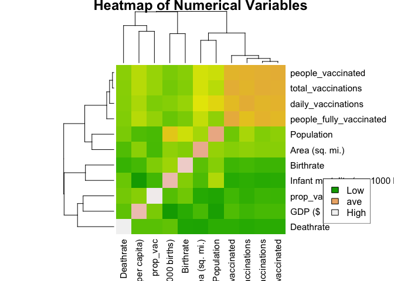

Project 1: COVID Vaccinations Around the World
================

## R Markdown

Emily Qiu, eq887\]

## Introduction:

The data sets chosen for this experiment are Countries of the World
which consists of statistics of every country
(<https://www.kaggle.com/fernandol/countries-of-the-world>) and COVID-19
World Vaccination Progress which consists of COVID vaccination
statistics
(<https://www.kaggle.com/gpreda/covid-world-vaccination-progress>) in
order to observe vaccinations depending on each country. The first data
set or ‘countries.of.the.world’ has twenty total variables including:
Country, Region, Population,Area (sq. mi.), Pop. Density (per sq. mi.),
Coastline (coast/area ratio), Net migration, Infant mortality (per 1000
births), GDP ($ per capita), and Literacy (%). The second data set or
‘vaccinations’ has fifteen total variables including: country,
iso\_code, date, total\_vaccinations, people\_vaccinated,
people\_fully\_vaccinated, daily\_vaccinations\_raw,
daily\_vaccinations, total\_vaccinations\_per\_hundred, and
people\_vaccinated\_per\_hundred. The data sets were both acquired from
kaggle and I chose them because they are related to one of the pressing,
present issues: COVID-19. I thought it would be interesting to see how
the condition of a country can influence vaccination data which can
serve as a representation of not only the country’s medical care but
also infection rate as well.

## Tidy:

``` r
library(tidyverse)
library(readxl)
countries.of.the.world<-read_csv("countries of the world.csv")
vaccinations<-read_csv("country_vaccinations.csv")
# Import the data
countries<-countries.of.the.world %>% mutate_all(na_if,"")
#mutate_alll affects every variable, and na_if converts to NA
```

Both data sets were already tidy. The only changes that needed to be
made was converting blank cells into NAs in the ‘countries.of.the.world’
data set and renaming the data set ‘countries.of.the.world’ to just
‘countries’ for easier use.

## Join/Merge:

``` r
countryvacc<-countries%>% left_join(vaccinations, by = c("Country"="country"))
#return all rows and all columns from both data sets
countryvacc<-countryvacc%>%select(-'Net migration')%>%select(-"Literacy (%)")%>%select(-"Coastline (coast/area ratio)")%>%select(-"Phones (per 1000)")%>%select(-"Arable (%)")%>%select(-"Industry")%>%select(-"Crops (%)")%>%select(-"Other (%)")%>%select(-"Agriculture")%>%select(-"Service")%>%select(-"Climate")%>%select(-"daily_vaccinations_raw")%>%select(-"total_vaccinations_per_hundred")%>%select(-"people_fully_vaccinated_per_hundred")%>%select(-"people_vaccinated_per_hundred")%>%select(-"source_website")%>%select(-"source_name")%>%select(-"iso_code")%>%select(-"daily_vaccinations_per_million")%>%select(-"vaccines")
#select(-) to remove variables
```

I used the left\_join() function because I wanted to merge operations
between both datasets by returning all of the rows from ‘countries’ and
any matching rows from ‘vaccinations’ without returning values of this
dataset that did not already exist in the first dataset because I wanted
to observe how the condition of a country can influence vaccination data
which requires data from both ‘countries’ and vaccinations. I dropped
many variables that I felt were either irrelevant towards the
relationship between country and vaccinations such as Net migration,
Literacy, Coastline, Phones, Climate, Arable, Crops, Agriculture,
Service, and dates. I also dropped variables that were repetitive of
another variable such as daily vaccination raw, total vaccination per
hundred, people fully vaccinated per hundred, people vaccinated per
hundred, and source website. The size of the cleaned, joined data set
was 14 variables and 6676 obervation

## Summary statistics:

``` r
#find date with the most date
countryvacc %>% select(date) %>% mutate(mode(date))
```

    ## # A tibble: 6,676 x 2
    ##    date       `mode(date)`
    ##    <date>     <chr>       
    ##  1 2021-02-22 numeric     
    ##  2 2021-02-23 numeric     
    ##  3 2021-02-24 numeric     
    ##  4 2021-02-25 numeric     
    ##  5 2021-02-26 numeric     
    ##  6 2021-02-27 numeric     
    ##  7 2021-02-28 numeric     
    ##  8 2021-03-01 numeric     
    ##  9 2021-03-02 numeric     
    ## 10 2021-03-03 numeric     
    ## # … with 6,666 more rows

``` r
#Arrange descending order of vaccines with selected date
countryvacc%>%filter(date =="2021-02-22")%>%arrange(desc(total_vaccinations))
```

    ## # A tibble: 102 x 14
    ##    Country  Region Population `Area (sq. mi.)` `Pop. Density (… `Infant mortali…
    ##    <chr>    <chr>       <dbl>            <dbl> <chr>                       <dbl>
    ##  1 United … NORTH…  298444215          9631420 31,0                           65
    ##  2 United … WESTE…   60609153           244820 247,6                         516
    ##  3 India    ASIA … 1095351995          3287590 333,2                        5629
    ##  4 Israel   NEAR …    6352117            20770 305,8                         703
    ##  5 Brazil   LATIN…  188078227          8511965 22,1                         2961
    ##  6 Turkey   NEAR …   70413958           780580 90,2                         4104
    ##  7 United … NEAR …    2602713            82880 31,4                         1451
    ##  8 Germany  WESTE…   82422299           357021 230,9                         416
    ##  9 France   WESTE…   60876136           547030 111,3                         426
    ## 10 Italy    WESTE…   58133509           301230 193,0                         594
    ## # … with 92 more rows, and 8 more variables: GDP ($ per capita) <dbl>,
    ## #   Birthrate <dbl>, Deathrate <dbl>, date <date>, total_vaccinations <dbl>,
    ## #   people_vaccinated <dbl>, people_fully_vaccinated <dbl>,
    ## #   daily_vaccinations <dbl>

``` r
#create a new variable that represent the proportion of the population vaccinated of each Country
countryvacc<-countryvacc%>%mutate(prop_vac=(people_vaccinated/Population)*100)
```

2021-02-22 was the date wth the most data and the United states had the
most Total vaccinations. A new variable was also created to represent
the proportion of the population vaccinated of each Country.

``` r
install.packages("kableExtra")
```

    ## 
    ## The downloaded binary packages are in
    ##  /var/folders/4f/t6dbjc0525l98dbtj98m9ly40000gn/T//Rtmpn3gq0e/downloaded_packages

``` r
library(kableExtra)
```

``` r
#mean of numerical variables
countryvacc %>%summarize(across(where(is.numeric), ~ mean(.x, na.rm = TRUE)))
```

    ## # A tibble: 1 x 11
    ##   Population `Area (sq. mi.)` `Infant mortality (pe… `GDP ($ per capi… Birthrate
    ##        <dbl>            <dbl>                  <dbl>             <dbl>     <dbl>
    ## 1  55384637.         1102594.                  1701.            15662.     1420.
    ## # … with 6 more variables: Deathrate <dbl>, total_vaccinations <dbl>,
    ## #   people_vaccinated <dbl>, people_fully_vaccinated <dbl>,
    ## #   daily_vaccinations <dbl>, prop_vac <dbl>

``` r
#mean of numerical variables grouped by Region
countryvacc %>%group_by(Region)%>% summarize(across(where(is.numeric), ~ mean(.x, na.rm = TRUE)))%>%kbl(caption = "Mean of numerical variables grouped by Region")%>%kable_styling()
```

<table class="table" style="margin-left: auto; margin-right: auto;">
<caption>
Mean of numerical variables grouped by Region
</caption>
<thead>
<tr>
<th style="text-align:left;">
Region
</th>
<th style="text-align:right;">
Population
</th>
<th style="text-align:right;">
Area (sq. mi.)
</th>
<th style="text-align:right;">
Infant mortality (per 1000 births)
</th>
<th style="text-align:right;">
GDP ($ per capita)
</th>
<th style="text-align:right;">
Birthrate
</th>
<th style="text-align:right;">
Deathrate
</th>
<th style="text-align:right;">
total\_vaccinations
</th>
<th style="text-align:right;">
people\_vaccinated
</th>
<th style="text-align:right;">
people\_fully\_vaccinated
</th>
<th style="text-align:right;">
daily\_vaccinations
</th>
<th style="text-align:right;">
prop\_vac
</th>
</tr>
</thead>
<tbody>
<tr>
<td style="text-align:left;">
ASIA (EX. NEAR EAST)
</td>
<td style="text-align:right;">
319106965
</td>
<td style="text-align:right;">
1882201.95
</td>
<td style="text-align:right;">
3301.2121
</td>
<td style="text-align:right;">
7315.014
</td>
<td style="text-align:right;">
1623.9366
</td>
<td style="text-align:right;">
744.8292
</td>
<td style="text-align:right;">
3176592.58
</td>
<td style="text-align:right;">
3012436.52
</td>
<td style="text-align:right;">
1467282.07
</td>
<td style="text-align:right;">
160155.468
</td>
<td style="text-align:right;">
0.9944962
</td>
</tr>
<tr>
<td style="text-align:left;">
BALTICS
</td>
<td style="text-align:right;">
2396979
</td>
<td style="text-align:right;">
58235.02
</td>
<td style="text-align:right;">
807.9421
</td>
<td style="text-align:right;">
11318.182
</td>
<td style="text-align:right;">
934.5041
</td>
<td style="text-align:right;">
1261.2975
</td>
<td style="text-align:right;">
92807.64
</td>
<td style="text-align:right;">
69724.78
</td>
<td style="text-align:right;">
33447.40
</td>
<td style="text-align:right;">
2936.937
</td>
<td style="text-align:right;">
2.8855678
</td>
</tr>
<tr>
<td style="text-align:left;">
C.W. OF IND. STATES
</td>
<td style="text-align:right;">
52530469
</td>
<td style="text-align:right;">
5601054.37
</td>
<td style="text-align:right;">
3090.8370
</td>
<td style="text-align:right;">
6161.755
</td>
<td style="text-align:right;">
1040.3009
</td>
<td style="text-align:right;">
1259.6207
</td>
<td style="text-align:right;">
1800241.49
</td>
<td style="text-align:right;">
1350813.86
</td>
<td style="text-align:right;">
1310830.58
</td>
<td style="text-align:right;">
27574.179
</td>
<td style="text-align:right;">
1.5735237
</td>
</tr>
<tr>
<td style="text-align:left;">
EASTERN EUROPE
</td>
<td style="text-align:right;">
11684144
</td>
<td style="text-align:right;">
113130.14
</td>
<td style="text-align:right;">
1290.3158
</td>
<td style="text-align:right;">
10122.333
</td>
<td style="text-align:right;">
917.9100
</td>
<td style="text-align:right;">
1081.6840
</td>
<td style="text-align:right;">
604465.23
</td>
<td style="text-align:right;">
445255.43
</td>
<td style="text-align:right;">
247150.27
</td>
<td style="text-align:right;">
18071.874
</td>
<td style="text-align:right;">
3.5773290
</td>
</tr>
<tr>
<td style="text-align:left;">
LATIN AMER. & CARIB
</td>
<td style="text-align:right;">
26865467
</td>
<td style="text-align:right;">
1029975.91
</td>
<td style="text-align:right;">
1866.5737
</td>
<td style="text-align:right;">
9057.289
</td>
<td style="text-align:right;">
1766.5090
</td>
<td style="text-align:right;">
568.7920
</td>
<td style="text-align:right;">
1071885.62
</td>
<td style="text-align:right;">
993853.05
</td>
<td style="text-align:right;">
377147.12
</td>
<td style="text-align:right;">
27163.772
</td>
<td style="text-align:right;">
4.4758058
</td>
</tr>
<tr>
<td style="text-align:left;">
NEAR EAST
</td>
<td style="text-align:right;">
10762690
</td>
<td style="text-align:right;">
288328.84
</td>
<td style="text-align:right;">
1670.2419
</td>
<td style="text-align:right;">
15336.717
</td>
<td style="text-align:right;">
1910.2268
</td>
<td style="text-align:right;">
416.8396
</td>
<td style="text-align:right;">
2871326.23
</td>
<td style="text-align:right;">
1868380.83
</td>
<td style="text-align:right;">
1382045.47
</td>
<td style="text-align:right;">
41419.729
</td>
<td style="text-align:right;">
25.6839097
</td>
</tr>
<tr>
<td style="text-align:left;">
NORTHERN AFRICA
</td>
<td style="text-align:right;">
33994990
</td>
<td style="text-align:right;">
950187.78
</td>
<td style="text-align:right;">
2874.3708
</td>
<td style="text-align:right;">
4782.022
</td>
<td style="text-align:right;">
2032.9101
</td>
<td style="text-align:right;">
524.8652
</td>
<td style="text-align:right;">
2251202.09
</td>
<td style="text-align:right;">
2998568.83
</td>
<td style="text-align:right;">
703348.92
</td>
<td style="text-align:right;">
75974.857
</td>
<td style="text-align:right;">
9.0235007
</td>
</tr>
<tr>
<td style="text-align:left;">
NORTHERN AMERICA
</td>
<td style="text-align:right;">
105047816
</td>
<td style="text-align:right;">
6639883.67
</td>
<td style="text-align:right;">
564.4650
</td>
<td style="text-align:right;">
32481.469
</td>
<td style="text-align:right;">
1026.8252
</td>
<td style="text-align:right;">
557.6119
</td>
<td style="text-align:right;">
20072641.74
</td>
<td style="text-align:right;">
16451758.66
</td>
<td style="text-align:right;">
7726553.94
</td>
<td style="text-align:right;">
407699.281
</td>
<td style="text-align:right;">
7.9611585
</td>
</tr>
<tr>
<td style="text-align:left;">
OCEANIA
</td>
<td style="text-align:right;">
9895476
</td>
<td style="text-align:right;">
3271917.15
</td>
<td style="text-align:right;">
887.0513
</td>
<td style="text-align:right;">
21055.000
</td>
<td style="text-align:right;">
1495.4051
</td>
<td style="text-align:right;">
694.7179
</td>
<td style="text-align:right;">
60387.37
</td>
<td style="text-align:right;">
37021.29
</td>
<td style="text-align:right;">
NaN
</td>
<td style="text-align:right;">
4051.717
</td>
<td style="text-align:right;">
0.2146453
</td>
</tr>
<tr>
<td style="text-align:left;">
SUB-SAHARAN AFRICA
</td>
<td style="text-align:right;">
16118729
</td>
<td style="text-align:right;">
337637.85
</td>
<td style="text-align:right;">
5297.2969
</td>
<td style="text-align:right;">
4181.771
</td>
<td style="text-align:right;">
2589.8125
</td>
<td style="text-align:right;">
1024.0078
</td>
<td style="text-align:right;">
64362.91
</td>
<td style="text-align:right;">
62020.75
</td>
<td style="text-align:right;">
56724.93
</td>
<td style="text-align:right;">
4053.796
</td>
<td style="text-align:right;">
10.6158015
</td>
</tr>
<tr>
<td style="text-align:left;">
WESTERN EUROPE
</td>
<td style="text-align:right;">
17247286
</td>
<td style="text-align:right;">
159948.81
</td>
<td style="text-align:right;">
438.6235
</td>
<td style="text-align:right;">
27490.187
</td>
<td style="text-align:right;">
999.5952
</td>
<td style="text-align:right;">
806.8517
</td>
<td style="text-align:right;">
1629411.19
</td>
<td style="text-align:right;">
1398291.46
</td>
<td style="text-align:right;">
386586.59
</td>
<td style="text-align:right;">
37265.826
</td>
<td style="text-align:right;">
9.2530752
</td>
</tr>
</tbody>
</table>

``` r
#standard deviation of numerical variables
countryvacc %>%summarize(across(where(is.numeric), ~ sd(.x, na.rm = TRUE)))
```

    ## # A tibble: 1 x 11
    ##   Population `Area (sq. mi.)` `Infant mortality (pe… `GDP ($ per capi… Birthrate
    ##        <dbl>            <dbl>                  <dbl>             <dbl>     <dbl>
    ## 1 187746666.         2891781.                  2213.            11433.      814.
    ## # … with 6 more variables: Deathrate <dbl>, total_vaccinations <dbl>,
    ## #   people_vaccinated <dbl>, people_fully_vaccinated <dbl>,
    ## #   daily_vaccinations <dbl>, prop_vac <dbl>

``` r
#standard deviation of numerical variables by Region
countryvacc %>%group_by(Region)%>%summarize(across(where(is.numeric), ~ var(.x, na.rm = TRUE)))%>%kbl(caption = "Standard deviation of numerical variables grouped by Region")%>%kable_styling()
```

<table class="table" style="margin-left: auto; margin-right: auto;">
<caption>
Standard deviation of numerical variables grouped by Region
</caption>
<thead>
<tr>
<th style="text-align:left;">
Region
</th>
<th style="text-align:right;">
Population
</th>
<th style="text-align:right;">
Area (sq. mi.)
</th>
<th style="text-align:right;">
Infant mortality (per 1000 births)
</th>
<th style="text-align:right;">
GDP ($ per capita)
</th>
<th style="text-align:right;">
Birthrate
</th>
<th style="text-align:right;">
Deathrate
</th>
<th style="text-align:right;">
total\_vaccinations
</th>
<th style="text-align:right;">
people\_vaccinated
</th>
<th style="text-align:right;">
people\_fully\_vaccinated
</th>
<th style="text-align:right;">
daily\_vaccinations
</th>
<th style="text-align:right;">
prop\_vac
</th>
</tr>
</thead>
<tbody>
<tr>
<td style="text-align:left;">
ASIA (EX. NEAR EAST)
</td>
<td style="text-align:right;">
2.282301e+17
</td>
<td style="text-align:right;">
9.379370e+12
</td>
<td style="text-align:right;">
12087126.97
</td>
<td style="text-align:right;">
75685526.0
</td>
<td style="text-align:right;">
880246.225
</td>
<td style="text-align:right;">
74403.248
</td>
<td style="text-align:right;">
6.233124e+13
</td>
<td style="text-align:right;">
3.609113e+13
</td>
<td style="text-align:right;">
3.385799e+12
</td>
<td style="text-align:right;">
106094725735
</td>
<td style="text-align:right;">
2.2123535
</td>
</tr>
<tr>
<td style="text-align:left;">
BALTICS
</td>
<td style="text-align:right;">
8.772746e+11
</td>
<td style="text-align:right;">
8.715450e+07
</td>
<td style="text-align:right;">
11962.10
</td>
<td style="text-align:right;">
734937.8
</td>
<td style="text-align:right;">
2883.736
</td>
<td style="text-align:right;">
14001.903
</td>
<td style="text-align:right;">
8.408657e+09
</td>
<td style="text-align:right;">
4.192709e+09
</td>
<td style="text-align:right;">
7.884272e+08
</td>
<td style="text-align:right;">
4988833
</td>
<td style="text-align:right;">
6.5431878
</td>
</tr>
<tr>
<td style="text-align:left;">
C.W. OF IND. STATES
</td>
<td style="text-align:right;">
3.570792e+15
</td>
<td style="text-align:right;">
5.676349e+13
</td>
<td style="text-align:right;">
6489113.12
</td>
<td style="text-align:right;">
4828721.4
</td>
<td style="text-align:right;">
422301.563
</td>
<td style="text-align:right;">
56791.903
</td>
<td style="text-align:right;">
8.633515e+12
</td>
<td style="text-align:right;">
4.651424e+12
</td>
<td style="text-align:right;">
7.580663e+11
</td>
<td style="text-align:right;">
2167263835
</td>
<td style="text-align:right;">
3.7791197
</td>
</tr>
<tr>
<td style="text-align:left;">
EASTERN EUROPE
</td>
<td style="text-align:right;">
1.268282e+14
</td>
<td style="text-align:right;">
9.021914e+09
</td>
<td style="text-align:right;">
556073.23
</td>
<td style="text-align:right;">
23320454.9
</td>
<td style="text-align:right;">
126834.237
</td>
<td style="text-align:right;">
60870.188
</td>
<td style="text-align:right;">
7.741639e+11
</td>
<td style="text-align:right;">
3.407989e+11
</td>
<td style="text-align:right;">
1.189094e+11
</td>
<td style="text-align:right;">
506237256
</td>
<td style="text-align:right;">
10.6561757
</td>
</tr>
<tr>
<td style="text-align:left;">
LATIN AMER. & CARIB
</td>
<td style="text-align:right;">
2.262936e+15
</td>
<td style="text-align:right;">
3.852355e+12
</td>
<td style="text-align:right;">
1524230.27
</td>
<td style="text-align:right;">
61683216.9
</td>
<td style="text-align:right;">
327949.817
</td>
<td style="text-align:right;">
28224.086
</td>
<td style="text-align:right;">
4.867728e+12
</td>
<td style="text-align:right;">
3.385445e+12
</td>
<td style="text-align:right;">
4.871737e+11
</td>
<td style="text-align:right;">
3880535967
</td>
<td style="text-align:right;">
70.5417964
</td>
</tr>
<tr>
<td style="text-align:left;">
NEAR EAST
</td>
<td style="text-align:right;">
3.738240e+14
</td>
<td style="text-align:right;">
3.258929e+11
</td>
<td style="text-align:right;">
785974.02
</td>
<td style="text-align:right;">
38624308.9
</td>
<td style="text-align:right;">
802145.538
</td>
<td style="text-align:right;">
40000.900
</td>
<td style="text-align:right;">
1.068102e+13
</td>
<td style="text-align:right;">
5.948544e+12
</td>
<td style="text-align:right;">
2.179780e+12
</td>
<td style="text-align:right;">
4708458892
</td>
<td style="text-align:right;">
650.6308880
</td>
</tr>
<tr>
<td style="text-align:left;">
NORTHERN AFRICA
</td>
<td style="text-align:right;">
2.317591e+14
</td>
<td style="text-align:right;">
7.203698e+11
</td>
<td style="text-align:right;">
3086695.92
</td>
<td style="text-align:right;">
1211491.3
</td>
<td style="text-align:right;">
71981.901
</td>
<td style="text-align:right;">
2024.527
</td>
<td style="text-align:right;">
4.620978e+12
</td>
<td style="text-align:right;">
2.260670e+12
</td>
<td style="text-align:right;">
5.415116e+11
</td>
<td style="text-align:right;">
5421310392
</td>
<td style="text-align:right;">
20.4053133
</td>
</tr>
<tr>
<td style="text-align:left;">
NORTHERN AMERICA
</td>
<td style="text-align:right;">
1.742230e+16
</td>
<td style="text-align:right;">
1.919198e+13
</td>
<td style="text-align:right;">
224106.75
</td>
<td style="text-align:right;">
35059479.9
</td>
<td style="text-align:right;">
276872.320
</td>
<td style="text-align:right;">
117078.477
</td>
<td style="text-align:right;">
1.038981e+15
</td>
<td style="text-align:right;">
5.002001e+14
</td>
<td style="text-align:right;">
1.420423e+14
</td>
<td style="text-align:right;">
487655279115
</td>
<td style="text-align:right;">
50.9569925
</td>
</tr>
<tr>
<td style="text-align:left;">
OCEANIA
</td>
<td style="text-align:right;">
7.868395e+13
</td>
<td style="text-align:right;">
1.386956e+13
</td>
<td style="text-align:right;">
1031948.72
</td>
<td style="text-align:right;">
85863519.0
</td>
<td style="text-align:right;">
270743.936
</td>
<td style="text-align:right;">
22399.867
</td>
<td style="text-align:right;">
5.144865e+09
</td>
<td style="text-align:right;">
2.058172e+09
</td>
<td style="text-align:right;">
NA
</td>
<td style="text-align:right;">
19569193
</td>
<td style="text-align:right;">
0.0565053
</td>
</tr>
<tr>
<td style="text-align:left;">
SUB-SAHARAN AFRICA
</td>
<td style="text-align:right;">
6.289696e+14
</td>
<td style="text-align:right;">
2.018147e+11
</td>
<td style="text-align:right;">
19021984.54
</td>
<td style="text-align:right;">
13725619.8
</td>
<td style="text-align:right;">
1822270.048
</td>
<td style="text-align:right;">
404189.104
</td>
<td style="text-align:right;">
6.129556e+09
</td>
<td style="text-align:right;">
6.160189e+09
</td>
<td style="text-align:right;">
2.890006e+09
</td>
<td style="text-align:right;">
45413199
</td>
<td style="text-align:right;">
451.0183590
</td>
</tr>
<tr>
<td style="text-align:left;">
WESTERN EUROPE
</td>
<td style="text-align:right;">
5.972517e+14
</td>
<td style="text-align:right;">
3.076482e+10
</td>
<td style="text-align:right;">
17226.59
</td>
<td style="text-align:right;">
59062710.5
</td>
<td style="text-align:right;">
69717.885
</td>
<td style="text-align:right;">
116280.028
</td>
<td style="text-align:right;">
1.484111e+13
</td>
<td style="text-align:right;">
1.313030e+13
</td>
<td style="text-align:right;">
3.568505e+11
</td>
<td style="text-align:right;">
5921307215
</td>
<td style="text-align:right;">
241.9019985
</td>
</tr>
</tbody>
</table>

``` r
#minimum of numerical variables
countryvacc %>%summarize(across(where(is.numeric), ~ min(.x, na.rm = TRUE)))
```

    ## # A tibble: 1 x 11
    ##   Population `Area (sq. mi.)` `Infant mortality (pe… `GDP ($ per capi… Birthrate
    ##        <dbl>            <dbl>                  <dbl>             <dbl>     <dbl>
    ## 1       7026                2                     19               500        10
    ## # … with 6 more variables: Deathrate <dbl>, total_vaccinations <dbl>,
    ## #   people_vaccinated <dbl>, people_fully_vaccinated <dbl>,
    ## #   daily_vaccinations <dbl>, prop_vac <dbl>

``` r
#minimum of numerical variables by Region
countryvacc  %>%group_by(Region) %>%summarize(across(where(is.numeric), ~ min(.x, na.rm = TRUE)))%>%kbl(caption = "Minimum of numerical variables grouped by Region")%>%kable_styling()
```

<table class="table" style="margin-left: auto; margin-right: auto;">
<caption>
Minimum of numerical variables grouped by Region
</caption>
<thead>
<tr>
<th style="text-align:left;">
Region
</th>
<th style="text-align:right;">
Population
</th>
<th style="text-align:right;">
Area (sq. mi.)
</th>
<th style="text-align:right;">
Infant mortality (per 1000 births)
</th>
<th style="text-align:right;">
GDP ($ per capita)
</th>
<th style="text-align:right;">
Birthrate
</th>
<th style="text-align:right;">
Deathrate
</th>
<th style="text-align:right;">
total\_vaccinations
</th>
<th style="text-align:right;">
people\_vaccinated
</th>
<th style="text-align:right;">
people\_fully\_vaccinated
</th>
<th style="text-align:right;">
daily\_vaccinations
</th>
<th style="text-align:right;">
prop\_vac
</th>
</tr>
</thead>
<tbody>
<tr>
<td style="text-align:left;">
ASIA (EX. NEAR EAST)
</td>
<td style="text-align:right;">
359008
</td>
<td style="text-align:right;">
28
</td>
<td style="text-align:right;">
64
</td>
<td style="text-align:right;">
500
</td>
<td style="text-align:right;">
10
</td>
<td style="text-align:right;">
127
</td>
<td style="text-align:right;">
0
</td>
<td style="text-align:right;">
0
</td>
<td style="text-align:right;">
35
</td>
<td style="text-align:right;">
26
</td>
<td style="text-align:right;">
0.0000000
</td>
</tr>
<tr>
<td style="text-align:left;">
BALTICS
</td>
<td style="text-align:right;">
1324333
</td>
<td style="text-align:right;">
45226
</td>
<td style="text-align:right;">
689
</td>
<td style="text-align:right;">
10200
</td>
<td style="text-align:right;">
875
</td>
<td style="text-align:right;">
1098
</td>
<td style="text-align:right;">
207
</td>
<td style="text-align:right;">
595
</td>
<td style="text-align:right;">
571
</td>
<td style="text-align:right;">
125
</td>
<td style="text-align:right;">
0.0261569
</td>
</tr>
<tr>
<td style="text-align:left;">
C.W. OF IND. STATES
</td>
<td style="text-align:right;">
2976372
</td>
<td style="text-align:right;">
29800
</td>
<td style="text-align:right;">
711
</td>
<td style="text-align:right;">
1000
</td>
<td style="text-align:right;">
16
</td>
<td style="text-align:right;">
86
</td>
<td style="text-align:right;">
0
</td>
<td style="text-align:right;">
0
</td>
<td style="text-align:right;">
1
</td>
<td style="text-align:right;">
403
</td>
<td style="text-align:right;">
0.0000000
</td>
</tr>
<tr>
<td style="text-align:left;">
EASTERN EUROPE
</td>
<td style="text-align:right;">
2010347
</td>
<td style="text-align:right;">
20273
</td>
<td style="text-align:right;">
393
</td>
<td style="text-align:right;">
2200
</td>
<td style="text-align:right;">
107
</td>
<td style="text-align:right;">
522
</td>
<td style="text-align:right;">
0
</td>
<td style="text-align:right;">
0
</td>
<td style="text-align:right;">
1
</td>
<td style="text-align:right;">
4
</td>
<td style="text-align:right;">
0.0000000
</td>
</tr>
<tr>
<td style="text-align:left;">
LATIN AMER. & CARIB
</td>
<td style="text-align:right;">
9439
</td>
<td style="text-align:right;">
102
</td>
<td style="text-align:right;">
86
</td>
<td style="text-align:right;">
1600
</td>
<td style="text-align:right;">
129
</td>
<td style="text-align:right;">
52
</td>
<td style="text-align:right;">
0
</td>
<td style="text-align:right;">
0
</td>
<td style="text-align:right;">
40
</td>
<td style="text-align:right;">
2
</td>
<td style="text-align:right;">
0.0000000
</td>
</tr>
<tr>
<td style="text-align:left;">
NEAR EAST
</td>
<td style="text-align:right;">
698585
</td>
<td style="text-align:right;">
360
</td>
<td style="text-align:right;">
615
</td>
<td style="text-align:right;">
600
</td>
<td style="text-align:right;">
178
</td>
<td style="text-align:right;">
38
</td>
<td style="text-align:right;">
0
</td>
<td style="text-align:right;">
0
</td>
<td style="text-align:right;">
2
</td>
<td style="text-align:right;">
48
</td>
<td style="text-align:right;">
0.0000000
</td>
</tr>
<tr>
<td style="text-align:left;">
NORTHERN AFRICA
</td>
<td style="text-align:right;">
273008
</td>
<td style="text-align:right;">
163610
</td>
<td style="text-align:right;">
31
</td>
<td style="text-align:right;">
4000
</td>
<td style="text-align:right;">
1552
</td>
<td style="text-align:right;">
348
</td>
<td style="text-align:right;">
0
</td>
<td style="text-align:right;">
0
</td>
<td style="text-align:right;">
4867
</td>
<td style="text-align:right;">
30
</td>
<td style="text-align:right;">
0.0000000
</td>
</tr>
<tr>
<td style="text-align:left;">
NORTHERN AMERICA
</td>
<td style="text-align:right;">
7026
</td>
<td style="text-align:right;">
53
</td>
<td style="text-align:right;">
65
</td>
<td style="text-align:right;">
6900
</td>
<td style="text-align:right;">
114
</td>
<td style="text-align:right;">
78
</td>
<td style="text-align:right;">
0
</td>
<td style="text-align:right;">
0
</td>
<td style="text-align:right;">
1203
</td>
<td style="text-align:right;">
77
</td>
<td style="text-align:right;">
0.0000000
</td>
</tr>
<tr>
<td style="text-align:left;">
OCEANIA
</td>
<td style="text-align:right;">
11810
</td>
<td style="text-align:right;">
21
</td>
<td style="text-align:right;">
469
</td>
<td style="text-align:right;">
800
</td>
<td style="text-align:right;">
21
</td>
<td style="text-align:right;">
67
</td>
<td style="text-align:right;">
0
</td>
<td style="text-align:right;">
0
</td>
<td style="text-align:right;">
Inf
</td>
<td style="text-align:right;">
3
</td>
<td style="text-align:right;">
0.0000000
</td>
</tr>
<tr>
<td style="text-align:left;">
SUB-SAHARAN AFRICA
</td>
<td style="text-align:right;">
7502
</td>
<td style="text-align:right;">
374
</td>
<td style="text-align:right;">
19
</td>
<td style="text-align:right;">
500
</td>
<td style="text-align:right;">
41
</td>
<td style="text-align:right;">
22
</td>
<td style="text-align:right;">
0
</td>
<td style="text-align:right;">
0
</td>
<td style="text-align:right;">
5
</td>
<td style="text-align:right;">
30
</td>
<td style="text-align:right;">
0.0000000
</td>
</tr>
<tr>
<td style="text-align:left;">
WESTERN EUROPE
</td>
<td style="text-align:right;">
27928
</td>
<td style="text-align:right;">
2
</td>
<td style="text-align:right;">
37
</td>
<td style="text-align:right;">
17500
</td>
<td style="text-align:right;">
93
</td>
<td style="text-align:right;">
81
</td>
<td style="text-align:right;">
0
</td>
<td style="text-align:right;">
5
</td>
<td style="text-align:right;">
2
</td>
<td style="text-align:right;">
1
</td>
<td style="text-align:right;">
0.0000214
</td>
</tr>
</tbody>
</table>

``` r
#maximum of numerical variables 
countryvacc %>%summarize(across(where(is.numeric), ~ max(.x, na.rm = TRUE)))
```

    ## # A tibble: 1 x 11
    ##   Population `Area (sq. mi.)` `Infant mortality (pe… `GDP ($ per capi… Birthrate
    ##        <dbl>            <dbl>                  <dbl>             <dbl>     <dbl>
    ## 1 1313973713         17075200                  19119             55100      5073
    ## # … with 6 more variables: Deathrate <dbl>, total_vaccinations <dbl>,
    ## #   people_vaccinated <dbl>, people_fully_vaccinated <dbl>,
    ## #   daily_vaccinations <dbl>, prop_vac <dbl>

``` r
#maximum of numerical variables by Region
countryvacc %>%group_by(Region)%>%summarize(across(where(is.numeric), ~ max(.x, na.rm = TRUE)))%>%kbl(caption = "Maximum of numerical variables grouped by Region")%>%kable_styling()
```

<table class="table" style="margin-left: auto; margin-right: auto;">
<caption>
Maximum of numerical variables grouped by Region
</caption>
<thead>
<tr>
<th style="text-align:left;">
Region
</th>
<th style="text-align:right;">
Population
</th>
<th style="text-align:right;">
Area (sq. mi.)
</th>
<th style="text-align:right;">
Infant mortality (per 1000 births)
</th>
<th style="text-align:right;">
GDP ($ per capita)
</th>
<th style="text-align:right;">
Birthrate
</th>
<th style="text-align:right;">
Deathrate
</th>
<th style="text-align:right;">
total\_vaccinations
</th>
<th style="text-align:right;">
people\_vaccinated
</th>
<th style="text-align:right;">
people\_fully\_vaccinated
</th>
<th style="text-align:right;">
daily\_vaccinations
</th>
<th style="text-align:right;">
prop\_vac
</th>
</tr>
</thead>
<tbody>
<tr>
<td style="text-align:left;">
ASIA (EX. NEAR EAST)
</td>
<td style="text-align:right;">
1313973713
</td>
<td style="text-align:right;">
9596960
</td>
<td style="text-align:right;">
16307
</td>
<td style="text-align:right;">
28800
</td>
<td style="text-align:right;">
3549
</td>
<td style="text-align:right;">
2034
</td>
<td style="text-align:right;">
64980000
</td>
<td style="text-align:right;">
34842030
</td>
<td style="text-align:right;">
7221362
</td>
<td style="text-align:right;">
1977848
</td>
<td style="text-align:right;">
12.2269737
</td>
</tr>
<tr>
<td style="text-align:left;">
BALTICS
</td>
<td style="text-align:right;">
3585906
</td>
<td style="text-align:right;">
65200
</td>
<td style="text-align:right;">
955
</td>
<td style="text-align:right;">
12300
</td>
<td style="text-align:right;">
1004
</td>
<td style="text-align:right;">
1366
</td>
<td style="text-align:right;">
390085
</td>
<td style="text-align:right;">
272246
</td>
<td style="text-align:right;">
117839
</td>
<td style="text-align:right;">
9435
</td>
<td style="text-align:right;">
11.8919486
</td>
</tr>
<tr>
<td style="text-align:left;">
C.W. OF IND. STATES
</td>
<td style="text-align:right;">
142893540
</td>
<td style="text-align:right;">
17075200
</td>
<td style="text-align:right;">
11076
</td>
<td style="text-align:right;">
8900
</td>
<td style="text-align:right;">
3265
</td>
<td style="text-align:right;">
1465
</td>
<td style="text-align:right;">
8185944
</td>
<td style="text-align:right;">
5545133
</td>
<td style="text-align:right;">
2641167
</td>
<td style="text-align:right;">
222684
</td>
<td style="text-align:right;">
5.6971578
</td>
</tr>
<tr>
<td style="text-align:left;">
EASTERN EUROPE
</td>
<td style="text-align:right;">
38536869
</td>
<td style="text-align:right;">
312685
</td>
<td style="text-align:right;">
2643
</td>
<td style="text-align:right;">
19000
</td>
<td style="text-align:right;">
1511
</td>
<td style="text-align:right;">
1427
</td>
<td style="text-align:right;">
4893320
</td>
<td style="text-align:right;">
3162971
</td>
<td style="text-align:right;">
1730349
</td>
<td style="text-align:right;">
94476
</td>
<td style="text-align:right;">
15.2319319
</td>
</tr>
<tr>
<td style="text-align:left;">
LATIN AMER. & CARIB
</td>
<td style="text-align:right;">
188078227
</td>
<td style="text-align:right;">
8511965
</td>
<td style="text-align:right;">
7345
</td>
<td style="text-align:right;">
35000
</td>
<td style="text-align:right;">
3644
</td>
<td style="text-align:right;">
1217
</td>
<td style="text-align:right;">
13335728
</td>
<td style="text-align:right;">
9970231
</td>
<td style="text-align:right;">
3365497
</td>
<td style="text-align:right;">
331400
</td>
<td style="text-align:right;">
57.9298354
</td>
</tr>
<tr>
<td style="text-align:left;">
NEAR EAST
</td>
<td style="text-align:right;">
70413958
</td>
<td style="text-align:right;">
1960582
</td>
<td style="text-align:right;">
5025
</td>
<td style="text-align:right;">
23200
</td>
<td style="text-align:right;">
4289
</td>
<td style="text-align:right;">
768
</td>
<td style="text-align:right;">
12844577
</td>
<td style="text-align:right;">
8007734
</td>
<td style="text-align:right;">
4836843
</td>
<td style="text-align:right;">
435596
</td>
<td style="text-align:right;">
133.7225810
</td>
</tr>
<tr>
<td style="text-align:left;">
NORTHERN AFRICA
</td>
<td style="text-align:right;">
78887007
</td>
<td style="text-align:right;">
2381740
</td>
<td style="text-align:right;">
4162
</td>
<td style="text-align:right;">
6900
</td>
<td style="text-align:right;">
2649
</td>
<td style="text-align:right;">
558
</td>
<td style="text-align:right;">
6611161
</td>
<td style="text-align:right;">
4258813
</td>
<td style="text-align:right;">
2352348
</td>
<td style="text-align:right;">
209026
</td>
<td style="text-align:right;">
12.8118282
</td>
</tr>
<tr>
<td style="text-align:left;">
NORTHERN AMERICA
</td>
<td style="text-align:right;">
298444215
</td>
<td style="text-align:right;">
9984670
</td>
<td style="text-align:right;">
1582
</td>
<td style="text-align:right;">
37800
</td>
<td style="text-align:right;">
1593
</td>
<td style="text-align:right;">
826
</td>
<td style="text-align:right;">
118313818
</td>
<td style="text-align:right;">
77230061
</td>
<td style="text-align:right;">
41934629
</td>
<td style="text-align:right;">
2541597
</td>
<td style="text-align:right;">
28.5937999
</td>
</tr>
<tr>
<td style="text-align:left;">
OCEANIA
</td>
<td style="text-align:right;">
20264082
</td>
<td style="text-align:right;">
7686850
</td>
<td style="text-align:right;">
5516
</td>
<td style="text-align:right;">
29000
</td>
<td style="text-align:right;">
3305
</td>
<td style="text-align:right;">
826
</td>
<td style="text-align:right;">
240754
</td>
<td style="text-align:right;">
159294
</td>
<td style="text-align:right;">
-Inf
</td>
<td style="text-align:right;">
15093
</td>
<td style="text-align:right;">
0.7860904
</td>
</tr>
<tr>
<td style="text-align:left;">
SUB-SAHARAN AFRICA
</td>
<td style="text-align:right;">
131859731
</td>
<td style="text-align:right;">
2505810
</td>
<td style="text-align:right;">
19119
</td>
<td style="text-align:right;">
11400
</td>
<td style="text-align:right;">
5073
</td>
<td style="text-align:right;">
2974
</td>
<td style="text-align:right;">
420000
</td>
<td style="text-align:right;">
420000
</td>
<td style="text-align:right;">
182983
</td>
<td style="text-align:right;">
34602
</td>
<td style="text-align:right;">
76.5958230
</td>
</tr>
<tr>
<td style="text-align:left;">
WESTERN EUROPE
</td>
<td style="text-align:right;">
82422299
</td>
<td style="text-align:right;">
547030
</td>
<td style="text-align:right;">
624
</td>
<td style="text-align:right;">
55100
</td>
<td style="text-align:right;">
1445
</td>
<td style="text-align:right;">
1291
</td>
<td style="text-align:right;">
28274802
</td>
<td style="text-align:right;">
26263732
</td>
<td style="text-align:right;">
3172533
</td>
<td style="text-align:right;">
502171
</td>
<td style="text-align:right;">
107.1075623
</td>
</tr>
</tbody>
</table>

``` r
#median of numerical variables 
countryvacc %>%summarize(across(where(is.numeric), ~ median(.x, na.rm = TRUE)))
```

    ## # A tibble: 1 x 11
    ##   Population `Area (sq. mi.)` `Infant mortality (pe… `GDP ($ per capi… Birthrate
    ##        <dbl>            <dbl>                  <dbl>             <dbl>     <dbl>
    ## 1    7523934            93030                    851             12300      1194
    ## # … with 6 more variables: Deathrate <dbl>, total_vaccinations <dbl>,
    ## #   people_vaccinated <dbl>, people_fully_vaccinated <dbl>,
    ## #   daily_vaccinations <dbl>, prop_vac <dbl>

``` r
#median of numerical variables by Region
countryvacc %>%group_by(Region)%>%summarize(across(where(is.numeric), ~ median(.x, na.rm = TRUE)))%>%kbl(caption = "Median of numerical variables grouped by Region")%>%kable_styling()
```

<table class="table" style="margin-left: auto; margin-right: auto;">
<caption>
Median of numerical variables grouped by Region
</caption>
<thead>
<tr>
<th style="text-align:left;">
Region
</th>
<th style="text-align:right;">
Population
</th>
<th style="text-align:right;">
Area (sq. mi.)
</th>
<th style="text-align:right;">
Infant mortality (per 1000 births)
</th>
<th style="text-align:right;">
GDP ($ per capita)
</th>
<th style="text-align:right;">
Birthrate
</th>
<th style="text-align:right;">
Deathrate
</th>
<th style="text-align:right;">
total\_vaccinations
</th>
<th style="text-align:right;">
people\_vaccinated
</th>
<th style="text-align:right;">
people\_fully\_vaccinated
</th>
<th style="text-align:right;">
daily\_vaccinations
</th>
<th style="text-align:right;">
prop\_vac
</th>
</tr>
</thead>
<tbody>
<tr>
<td style="text-align:left;">
ASIA (EX. NEAR EAST)
</td>
<td style="text-align:right;">
84402966
</td>
<td style="text-align:right;">
377835
</td>
<td style="text-align:right;">
2418
</td>
<td style="text-align:right;">
3700
</td>
<td style="text-align:right;">
1551
</td>
<td style="text-align:right;">
697
</td>
<td style="text-align:right;">
211558.0
</td>
<td style="text-align:right;">
337769.0
</td>
<td style="text-align:right;">
825650.0
</td>
<td style="text-align:right;">
14561.5
</td>
<td style="text-align:right;">
0.4987074
</td>
</tr>
<tr>
<td style="text-align:left;">
BALTICS
</td>
<td style="text-align:right;">
2274735
</td>
<td style="text-align:right;">
64589
</td>
<td style="text-align:right;">
787
</td>
<td style="text-align:right;">
11400
</td>
<td style="text-align:right;">
924
</td>
<td style="text-align:right;">
1325
</td>
<td style="text-align:right;">
63794.5
</td>
<td style="text-align:right;">
51674.0
</td>
<td style="text-align:right;">
18936.0
</td>
<td style="text-align:right;">
2283.5
</td>
<td style="text-align:right;">
2.1488063
</td>
</tr>
<tr>
<td style="text-align:left;">
C.W. OF IND. STATES
</td>
<td style="text-align:right;">
15233244
</td>
<td style="text-align:right;">
603700
</td>
<td style="text-align:right;">
1539
</td>
<td style="text-align:right;">
6100
</td>
<td style="text-align:right;">
995
</td>
<td style="text-align:right;">
1402
</td>
<td style="text-align:right;">
52577.5
</td>
<td style="text-align:right;">
52577.5
</td>
<td style="text-align:right;">
1514547.5
</td>
<td style="text-align:right;">
3357.0
</td>
<td style="text-align:right;">
0.2707252
</td>
</tr>
<tr>
<td style="text-align:left;">
EASTERN EUROPE
</td>
<td style="text-align:right;">
7385367
</td>
<td style="text-align:right;">
88361
</td>
<td style="text-align:right;">
857
</td>
<td style="text-align:right;">
10600
</td>
<td style="text-align:right;">
965
</td>
<td style="text-align:right;">
1148
</td>
<td style="text-align:right;">
216304.0
</td>
<td style="text-align:right;">
200486.0
</td>
<td style="text-align:right;">
76830.5
</td>
<td style="text-align:right;">
7435.0
</td>
<td style="text-align:right;">
2.7771601
</td>
</tr>
<tr>
<td style="text-align:left;">
LATIN AMER. & CARIB
</td>
<td style="text-align:right;">
6822378
</td>
<td style="text-align:right;">
176220
</td>
<td style="text-align:right;">
2047
</td>
<td style="text-align:right;">
6300
</td>
<td style="text-align:right;">
1828
</td>
<td style="text-align:right;">
572
</td>
<td style="text-align:right;">
127510.5
</td>
<td style="text-align:right;">
147544.0
</td>
<td style="text-align:right;">
57994.0
</td>
<td style="text-align:right;">
1694.0
</td>
<td style="text-align:right;">
1.1162163
</td>
</tr>
<tr>
<td style="text-align:left;">
NEAR EAST
</td>
<td style="text-align:right;">
3102229
</td>
<td style="text-align:right;">
20770
</td>
<td style="text-align:right;">
1727
</td>
<td style="text-align:right;">
16900
</td>
<td style="text-align:right;">
1852
</td>
<td style="text-align:right;">
414
</td>
<td style="text-align:right;">
1432889.0
</td>
<td style="text-align:right;">
292917.0
</td>
<td style="text-align:right;">
806643.0
</td>
<td style="text-align:right;">
7370.0
</td>
<td style="text-align:right;">
13.9962925
</td>
</tr>
<tr>
<td style="text-align:left;">
NORTHERN AFRICA
</td>
<td style="text-align:right;">
33241259
</td>
<td style="text-align:right;">
446550
</td>
<td style="text-align:right;">
4162
</td>
<td style="text-align:right;">
4000
</td>
<td style="text-align:right;">
2198
</td>
<td style="text-align:right;">
558
</td>
<td style="text-align:right;">
1904169.0
</td>
<td style="text-align:right;">
3657468.0
</td>
<td style="text-align:right;">
456487.0
</td>
<td style="text-align:right;">
51429.0
</td>
<td style="text-align:right;">
11.0027963
</td>
</tr>
<tr>
<td style="text-align:left;">
NORTHERN AMERICA
</td>
<td style="text-align:right;">
33098932
</td>
<td style="text-align:right;">
9631420
</td>
<td style="text-align:right;">
475
</td>
<td style="text-align:right;">
36000
</td>
<td style="text-align:right;">
1078
</td>
<td style="text-align:right;">
774
</td>
<td style="text-align:right;">
1840435.0
</td>
<td style="text-align:right;">
2082474.5
</td>
<td style="text-align:right;">
583483.0
</td>
<td style="text-align:right;">
26062.0
</td>
<td style="text-align:right;">
5.0797459
</td>
</tr>
<tr>
<td style="text-align:left;">
OCEANIA
</td>
<td style="text-align:right;">
4076140
</td>
<td style="text-align:right;">
268680
</td>
<td style="text-align:right;">
585
</td>
<td style="text-align:right;">
21600
</td>
<td style="text-align:right;">
1376
</td>
<td style="text-align:right;">
751
</td>
<td style="text-align:right;">
30000.0
</td>
<td style="text-align:right;">
18000.0
</td>
<td style="text-align:right;">
NA
</td>
<td style="text-align:right;">
1518.0
</td>
<td style="text-align:right;">
0.1480452
</td>
</tr>
<tr>
<td style="text-align:left;">
SUB-SAHARAN AFRICA
</td>
<td style="text-align:right;">
10723106
</td>
<td style="text-align:right;">
196190
</td>
<td style="text-align:right;">
5551
</td>
<td style="text-align:right;">
2150
</td>
<td style="text-align:right;">
2801
</td>
<td style="text-align:right;">
942
</td>
<td style="text-align:right;">
36321.5
</td>
<td style="text-align:right;">
36359.0
</td>
<td style="text-align:right;">
26965.0
</td>
<td style="text-align:right;">
1572.0
</td>
<td style="text-align:right;">
0.3077601
</td>
</tr>
<tr>
<td style="text-align:left;">
WESTERN EUROPE
</td>
<td style="text-align:right;">
5450661
</td>
<td style="text-align:right;">
83870
</td>
<td style="text-align:right;">
468
</td>
<td style="text-align:right;">
27600
</td>
<td style="text-align:right;">
1038
</td>
<td style="text-align:right;">
931
</td>
<td style="text-align:right;">
340335.0
</td>
<td style="text-align:right;">
281843.5
</td>
<td style="text-align:right;">
147528.0
</td>
<td style="text-align:right;">
9945.0
</td>
<td style="text-align:right;">
4.5686466
</td>
</tr>
</tbody>
</table>

``` r
#range of numerical variables 
countryvacc %>%summarize(across(where(is.numeric), ~ range(.x, na.rm = TRUE)))
```

    ## # A tibble: 2 x 11
    ##   Population `Area (sq. mi.)` `Infant mortality (pe… `GDP ($ per capi… Birthrate
    ##        <dbl>            <dbl>                  <dbl>             <dbl>     <dbl>
    ## 1       7026                2                     19               500        10
    ## 2 1313973713         17075200                  19119             55100      5073
    ## # … with 6 more variables: Deathrate <dbl>, total_vaccinations <dbl>,
    ## #   people_vaccinated <dbl>, people_fully_vaccinated <dbl>,
    ## #   daily_vaccinations <dbl>, prop_vac <dbl>

``` r
#range of numerical variables by Region
countryvacc %>%group_by(Region)%>%summarize(across(where(is.numeric), ~ range(.x, na.rm = TRUE)))%>%kbl(caption = "Range of numerical variables grouped by Region")%>%kable_styling()
```

<table class="table" style="margin-left: auto; margin-right: auto;">
<caption>
Range of numerical variables grouped by Region
</caption>
<thead>
<tr>
<th style="text-align:left;">
Region
</th>
<th style="text-align:right;">
Population
</th>
<th style="text-align:right;">
Area (sq. mi.)
</th>
<th style="text-align:right;">
Infant mortality (per 1000 births)
</th>
<th style="text-align:right;">
GDP ($ per capita)
</th>
<th style="text-align:right;">
Birthrate
</th>
<th style="text-align:right;">
Deathrate
</th>
<th style="text-align:right;">
total\_vaccinations
</th>
<th style="text-align:right;">
people\_vaccinated
</th>
<th style="text-align:right;">
people\_fully\_vaccinated
</th>
<th style="text-align:right;">
daily\_vaccinations
</th>
<th style="text-align:right;">
prop\_vac
</th>
</tr>
</thead>
<tbody>
<tr>
<td style="text-align:left;">
ASIA (EX. NEAR EAST)
</td>
<td style="text-align:right;">
359008
</td>
<td style="text-align:right;">
28
</td>
<td style="text-align:right;">
64
</td>
<td style="text-align:right;">
500
</td>
<td style="text-align:right;">
10
</td>
<td style="text-align:right;">
127
</td>
<td style="text-align:right;">
0
</td>
<td style="text-align:right;">
0
</td>
<td style="text-align:right;">
35
</td>
<td style="text-align:right;">
26
</td>
<td style="text-align:right;">
0.0000000
</td>
</tr>
<tr>
<td style="text-align:left;">
ASIA (EX. NEAR EAST)
</td>
<td style="text-align:right;">
1313973713
</td>
<td style="text-align:right;">
9596960
</td>
<td style="text-align:right;">
16307
</td>
<td style="text-align:right;">
28800
</td>
<td style="text-align:right;">
3549
</td>
<td style="text-align:right;">
2034
</td>
<td style="text-align:right;">
64980000
</td>
<td style="text-align:right;">
34842030
</td>
<td style="text-align:right;">
7221362
</td>
<td style="text-align:right;">
1977848
</td>
<td style="text-align:right;">
12.2269737
</td>
</tr>
<tr>
<td style="text-align:left;">
BALTICS
</td>
<td style="text-align:right;">
1324333
</td>
<td style="text-align:right;">
45226
</td>
<td style="text-align:right;">
689
</td>
<td style="text-align:right;">
10200
</td>
<td style="text-align:right;">
875
</td>
<td style="text-align:right;">
1098
</td>
<td style="text-align:right;">
207
</td>
<td style="text-align:right;">
595
</td>
<td style="text-align:right;">
571
</td>
<td style="text-align:right;">
125
</td>
<td style="text-align:right;">
0.0261569
</td>
</tr>
<tr>
<td style="text-align:left;">
BALTICS
</td>
<td style="text-align:right;">
3585906
</td>
<td style="text-align:right;">
65200
</td>
<td style="text-align:right;">
955
</td>
<td style="text-align:right;">
12300
</td>
<td style="text-align:right;">
1004
</td>
<td style="text-align:right;">
1366
</td>
<td style="text-align:right;">
390085
</td>
<td style="text-align:right;">
272246
</td>
<td style="text-align:right;">
117839
</td>
<td style="text-align:right;">
9435
</td>
<td style="text-align:right;">
11.8919486
</td>
</tr>
<tr>
<td style="text-align:left;">
C.W. OF IND. STATES
</td>
<td style="text-align:right;">
2976372
</td>
<td style="text-align:right;">
29800
</td>
<td style="text-align:right;">
711
</td>
<td style="text-align:right;">
1000
</td>
<td style="text-align:right;">
16
</td>
<td style="text-align:right;">
86
</td>
<td style="text-align:right;">
0
</td>
<td style="text-align:right;">
0
</td>
<td style="text-align:right;">
1
</td>
<td style="text-align:right;">
403
</td>
<td style="text-align:right;">
0.0000000
</td>
</tr>
<tr>
<td style="text-align:left;">
C.W. OF IND. STATES
</td>
<td style="text-align:right;">
142893540
</td>
<td style="text-align:right;">
17075200
</td>
<td style="text-align:right;">
11076
</td>
<td style="text-align:right;">
8900
</td>
<td style="text-align:right;">
3265
</td>
<td style="text-align:right;">
1465
</td>
<td style="text-align:right;">
8185944
</td>
<td style="text-align:right;">
5545133
</td>
<td style="text-align:right;">
2641167
</td>
<td style="text-align:right;">
222684
</td>
<td style="text-align:right;">
5.6971578
</td>
</tr>
<tr>
<td style="text-align:left;">
EASTERN EUROPE
</td>
<td style="text-align:right;">
2010347
</td>
<td style="text-align:right;">
20273
</td>
<td style="text-align:right;">
393
</td>
<td style="text-align:right;">
2200
</td>
<td style="text-align:right;">
107
</td>
<td style="text-align:right;">
522
</td>
<td style="text-align:right;">
0
</td>
<td style="text-align:right;">
0
</td>
<td style="text-align:right;">
1
</td>
<td style="text-align:right;">
4
</td>
<td style="text-align:right;">
0.0000000
</td>
</tr>
<tr>
<td style="text-align:left;">
EASTERN EUROPE
</td>
<td style="text-align:right;">
38536869
</td>
<td style="text-align:right;">
312685
</td>
<td style="text-align:right;">
2643
</td>
<td style="text-align:right;">
19000
</td>
<td style="text-align:right;">
1511
</td>
<td style="text-align:right;">
1427
</td>
<td style="text-align:right;">
4893320
</td>
<td style="text-align:right;">
3162971
</td>
<td style="text-align:right;">
1730349
</td>
<td style="text-align:right;">
94476
</td>
<td style="text-align:right;">
15.2319319
</td>
</tr>
<tr>
<td style="text-align:left;">
LATIN AMER. & CARIB
</td>
<td style="text-align:right;">
9439
</td>
<td style="text-align:right;">
102
</td>
<td style="text-align:right;">
86
</td>
<td style="text-align:right;">
1600
</td>
<td style="text-align:right;">
129
</td>
<td style="text-align:right;">
52
</td>
<td style="text-align:right;">
0
</td>
<td style="text-align:right;">
0
</td>
<td style="text-align:right;">
40
</td>
<td style="text-align:right;">
2
</td>
<td style="text-align:right;">
0.0000000
</td>
</tr>
<tr>
<td style="text-align:left;">
LATIN AMER. & CARIB
</td>
<td style="text-align:right;">
188078227
</td>
<td style="text-align:right;">
8511965
</td>
<td style="text-align:right;">
7345
</td>
<td style="text-align:right;">
35000
</td>
<td style="text-align:right;">
3644
</td>
<td style="text-align:right;">
1217
</td>
<td style="text-align:right;">
13335728
</td>
<td style="text-align:right;">
9970231
</td>
<td style="text-align:right;">
3365497
</td>
<td style="text-align:right;">
331400
</td>
<td style="text-align:right;">
57.9298354
</td>
</tr>
<tr>
<td style="text-align:left;">
NEAR EAST
</td>
<td style="text-align:right;">
698585
</td>
<td style="text-align:right;">
360
</td>
<td style="text-align:right;">
615
</td>
<td style="text-align:right;">
600
</td>
<td style="text-align:right;">
178
</td>
<td style="text-align:right;">
38
</td>
<td style="text-align:right;">
0
</td>
<td style="text-align:right;">
0
</td>
<td style="text-align:right;">
2
</td>
<td style="text-align:right;">
48
</td>
<td style="text-align:right;">
0.0000000
</td>
</tr>
<tr>
<td style="text-align:left;">
NEAR EAST
</td>
<td style="text-align:right;">
70413958
</td>
<td style="text-align:right;">
1960582
</td>
<td style="text-align:right;">
5025
</td>
<td style="text-align:right;">
23200
</td>
<td style="text-align:right;">
4289
</td>
<td style="text-align:right;">
768
</td>
<td style="text-align:right;">
12844577
</td>
<td style="text-align:right;">
8007734
</td>
<td style="text-align:right;">
4836843
</td>
<td style="text-align:right;">
435596
</td>
<td style="text-align:right;">
133.7225810
</td>
</tr>
<tr>
<td style="text-align:left;">
NORTHERN AFRICA
</td>
<td style="text-align:right;">
273008
</td>
<td style="text-align:right;">
163610
</td>
<td style="text-align:right;">
31
</td>
<td style="text-align:right;">
4000
</td>
<td style="text-align:right;">
1552
</td>
<td style="text-align:right;">
348
</td>
<td style="text-align:right;">
0
</td>
<td style="text-align:right;">
0
</td>
<td style="text-align:right;">
4867
</td>
<td style="text-align:right;">
30
</td>
<td style="text-align:right;">
0.0000000
</td>
</tr>
<tr>
<td style="text-align:left;">
NORTHERN AFRICA
</td>
<td style="text-align:right;">
78887007
</td>
<td style="text-align:right;">
2381740
</td>
<td style="text-align:right;">
4162
</td>
<td style="text-align:right;">
6900
</td>
<td style="text-align:right;">
2649
</td>
<td style="text-align:right;">
558
</td>
<td style="text-align:right;">
6611161
</td>
<td style="text-align:right;">
4258813
</td>
<td style="text-align:right;">
2352348
</td>
<td style="text-align:right;">
209026
</td>
<td style="text-align:right;">
12.8118282
</td>
</tr>
<tr>
<td style="text-align:left;">
NORTHERN AMERICA
</td>
<td style="text-align:right;">
7026
</td>
<td style="text-align:right;">
53
</td>
<td style="text-align:right;">
65
</td>
<td style="text-align:right;">
6900
</td>
<td style="text-align:right;">
114
</td>
<td style="text-align:right;">
78
</td>
<td style="text-align:right;">
0
</td>
<td style="text-align:right;">
0
</td>
<td style="text-align:right;">
1203
</td>
<td style="text-align:right;">
77
</td>
<td style="text-align:right;">
0.0000000
</td>
</tr>
<tr>
<td style="text-align:left;">
NORTHERN AMERICA
</td>
<td style="text-align:right;">
298444215
</td>
<td style="text-align:right;">
9984670
</td>
<td style="text-align:right;">
1582
</td>
<td style="text-align:right;">
37800
</td>
<td style="text-align:right;">
1593
</td>
<td style="text-align:right;">
826
</td>
<td style="text-align:right;">
118313818
</td>
<td style="text-align:right;">
77230061
</td>
<td style="text-align:right;">
41934629
</td>
<td style="text-align:right;">
2541597
</td>
<td style="text-align:right;">
28.5937999
</td>
</tr>
<tr>
<td style="text-align:left;">
OCEANIA
</td>
<td style="text-align:right;">
11810
</td>
<td style="text-align:right;">
21
</td>
<td style="text-align:right;">
469
</td>
<td style="text-align:right;">
800
</td>
<td style="text-align:right;">
21
</td>
<td style="text-align:right;">
67
</td>
<td style="text-align:right;">
0
</td>
<td style="text-align:right;">
0
</td>
<td style="text-align:right;">
Inf
</td>
<td style="text-align:right;">
3
</td>
<td style="text-align:right;">
0.0000000
</td>
</tr>
<tr>
<td style="text-align:left;">
OCEANIA
</td>
<td style="text-align:right;">
20264082
</td>
<td style="text-align:right;">
7686850
</td>
<td style="text-align:right;">
5516
</td>
<td style="text-align:right;">
29000
</td>
<td style="text-align:right;">
3305
</td>
<td style="text-align:right;">
826
</td>
<td style="text-align:right;">
240754
</td>
<td style="text-align:right;">
159294
</td>
<td style="text-align:right;">
-Inf
</td>
<td style="text-align:right;">
15093
</td>
<td style="text-align:right;">
0.7860904
</td>
</tr>
<tr>
<td style="text-align:left;">
SUB-SAHARAN AFRICA
</td>
<td style="text-align:right;">
7502
</td>
<td style="text-align:right;">
374
</td>
<td style="text-align:right;">
19
</td>
<td style="text-align:right;">
500
</td>
<td style="text-align:right;">
41
</td>
<td style="text-align:right;">
22
</td>
<td style="text-align:right;">
0
</td>
<td style="text-align:right;">
0
</td>
<td style="text-align:right;">
5
</td>
<td style="text-align:right;">
30
</td>
<td style="text-align:right;">
0.0000000
</td>
</tr>
<tr>
<td style="text-align:left;">
SUB-SAHARAN AFRICA
</td>
<td style="text-align:right;">
131859731
</td>
<td style="text-align:right;">
2505810
</td>
<td style="text-align:right;">
19119
</td>
<td style="text-align:right;">
11400
</td>
<td style="text-align:right;">
5073
</td>
<td style="text-align:right;">
2974
</td>
<td style="text-align:right;">
420000
</td>
<td style="text-align:right;">
420000
</td>
<td style="text-align:right;">
182983
</td>
<td style="text-align:right;">
34602
</td>
<td style="text-align:right;">
76.5958230
</td>
</tr>
<tr>
<td style="text-align:left;">
WESTERN EUROPE
</td>
<td style="text-align:right;">
27928
</td>
<td style="text-align:right;">
2
</td>
<td style="text-align:right;">
37
</td>
<td style="text-align:right;">
17500
</td>
<td style="text-align:right;">
93
</td>
<td style="text-align:right;">
81
</td>
<td style="text-align:right;">
0
</td>
<td style="text-align:right;">
5
</td>
<td style="text-align:right;">
2
</td>
<td style="text-align:right;">
1
</td>
<td style="text-align:right;">
0.0000214
</td>
</tr>
<tr>
<td style="text-align:left;">
WESTERN EUROPE
</td>
<td style="text-align:right;">
82422299
</td>
<td style="text-align:right;">
547030
</td>
<td style="text-align:right;">
624
</td>
<td style="text-align:right;">
55100
</td>
<td style="text-align:right;">
1445
</td>
<td style="text-align:right;">
1291
</td>
<td style="text-align:right;">
28274802
</td>
<td style="text-align:right;">
26263732
</td>
<td style="text-align:right;">
3172533
</td>
<td style="text-align:right;">
502171
</td>
<td style="text-align:right;">
107.1075623
</td>
</tr>
</tbody>
</table>

``` r
#quantile of numerical variables 
countryvacc %>%summarize(across(where(is.numeric), ~ quantile(.x, na.rm = TRUE)))
```

    ## # A tibble: 5 x 11
    ##   Population `Area (sq. mi.)` `Infant mortality (pe… `GDP ($ per capi… Birthrate
    ##        <dbl>            <dbl>                  <dbl>             <dbl>     <dbl>
    ## 1       7026                2                     19               500        10
    ## 2    2010347            20770                    471              5400       968
    ## 3    7523934            93030                    851             12300      1194
    ## 4   32930091           449964                   2055             26700      1828
    ## 5 1313973713         17075200                  19119             55100      5073
    ## # … with 6 more variables: Deathrate <dbl>, total_vaccinations <dbl>,
    ## #   people_vaccinated <dbl>, people_fully_vaccinated <dbl>,
    ## #   daily_vaccinations <dbl>, prop_vac <dbl>

``` r
#quantile of numerical variables by Region
countryvacc %>%group_by(Region)%>%summarize(across(where(is.numeric), ~ quantile(.x, na.rm = TRUE)))%>%kbl(caption = "Quantile of numerical variables grouped by Region")%>%kable_styling()
```

<table class="table" style="margin-left: auto; margin-right: auto;">
<caption>
Quantile of numerical variables grouped by Region
</caption>
<thead>
<tr>
<th style="text-align:left;">
Region
</th>
<th style="text-align:right;">
Population
</th>
<th style="text-align:right;">
Area (sq. mi.)
</th>
<th style="text-align:right;">
Infant mortality (per 1000 births)
</th>
<th style="text-align:right;">
GDP ($ per capita)
</th>
<th style="text-align:right;">
Birthrate
</th>
<th style="text-align:right;">
Deathrate
</th>
<th style="text-align:right;">
total\_vaccinations
</th>
<th style="text-align:right;">
people\_vaccinated
</th>
<th style="text-align:right;">
people\_fully\_vaccinated
</th>
<th style="text-align:right;">
daily\_vaccinations
</th>
<th style="text-align:right;">
prop\_vac
</th>
</tr>
</thead>
<tbody>
<tr>
<td style="text-align:left;">
ASIA (EX. NEAR EAST)
</td>
<td style="text-align:right;">
359008
</td>
<td style="text-align:right;">
28
</td>
<td style="text-align:right;">
64.00
</td>
<td style="text-align:right;">
500
</td>
<td style="text-align:right;">
10
</td>
<td style="text-align:right;">
127.00
</td>
<td style="text-align:right;">
0.00
</td>
<td style="text-align:right;">
0.00
</td>
<td style="text-align:right;">
35.00
</td>
<td style="text-align:right;">
26.00
</td>
<td style="text-align:right;">
0.0000000
</td>
</tr>
<tr>
<td style="text-align:left;">
ASIA (EX. NEAR EAST)
</td>
<td style="text-align:right;">
13881427
</td>
<td style="text-align:right;">
65610
</td>
<td style="text-align:right;">
356.00
</td>
<td style="text-align:right;">
2100
</td>
<td style="text-align:right;">
934
</td>
<td style="text-align:right;">
625.00
</td>
<td style="text-align:right;">
53960.50
</td>
<td style="text-align:right;">
52284.00
</td>
<td style="text-align:right;">
128966.00
</td>
<td style="text-align:right;">
4097.50
</td>
<td style="text-align:right;">
0.0854166
</td>
</tr>
<tr>
<td style="text-align:left;">
ASIA (EX. NEAR EAST)
</td>
<td style="text-align:right;">
84402966
</td>
<td style="text-align:right;">
377835
</td>
<td style="text-align:right;">
2418.00
</td>
<td style="text-align:right;">
3700
</td>
<td style="text-align:right;">
1551
</td>
<td style="text-align:right;">
697.00
</td>
<td style="text-align:right;">
211558.00
</td>
<td style="text-align:right;">
337769.00
</td>
<td style="text-align:right;">
825650.00
</td>
<td style="text-align:right;">
14561.50
</td>
<td style="text-align:right;">
0.4987074
</td>
</tr>
<tr>
<td style="text-align:left;">
ASIA (EX. NEAR EAST)
</td>
<td style="text-align:right;">
245452739
</td>
<td style="text-align:right;">
1919440
</td>
<td style="text-align:right;">
5629.00
</td>
<td style="text-align:right;">
5000
</td>
<td style="text-align:right;">
2201
</td>
<td style="text-align:right;">
823.00
</td>
<td style="text-align:right;">
1973496.00
</td>
<td style="text-align:right;">
3047649.00
</td>
<td style="text-align:right;">
1912335.50
</td>
<td style="text-align:right;">
154954.25
</td>
<td style="text-align:right;">
1.3266787
</td>
</tr>
<tr>
<td style="text-align:left;">
ASIA (EX. NEAR EAST)
</td>
<td style="text-align:right;">
1313973713
</td>
<td style="text-align:right;">
9596960
</td>
<td style="text-align:right;">
16307.00
</td>
<td style="text-align:right;">
28800
</td>
<td style="text-align:right;">
3549
</td>
<td style="text-align:right;">
2034.00
</td>
<td style="text-align:right;">
64980000.00
</td>
<td style="text-align:right;">
34842030.00
</td>
<td style="text-align:right;">
7221362.00
</td>
<td style="text-align:right;">
1977848.00
</td>
<td style="text-align:right;">
12.2269737
</td>
</tr>
<tr>
<td style="text-align:left;">
BALTICS
</td>
<td style="text-align:right;">
1324333
</td>
<td style="text-align:right;">
45226
</td>
<td style="text-align:right;">
689.00
</td>
<td style="text-align:right;">
10200
</td>
<td style="text-align:right;">
875
</td>
<td style="text-align:right;">
1098.00
</td>
<td style="text-align:right;">
207.00
</td>
<td style="text-align:right;">
595.00
</td>
<td style="text-align:right;">
571.00
</td>
<td style="text-align:right;">
125.00
</td>
<td style="text-align:right;">
0.0261569
</td>
</tr>
<tr>
<td style="text-align:left;">
BALTICS
</td>
<td style="text-align:right;">
1324333
</td>
<td style="text-align:right;">
45226
</td>
<td style="text-align:right;">
689.00
</td>
<td style="text-align:right;">
10200
</td>
<td style="text-align:right;">
875
</td>
<td style="text-align:right;">
1098.00
</td>
<td style="text-align:right;">
26004.50
</td>
<td style="text-align:right;">
20646.00
</td>
<td style="text-align:right;">
15165.00
</td>
<td style="text-align:right;">
1133.25
</td>
<td style="text-align:right;">
0.7840694
</td>
</tr>
<tr>
<td style="text-align:left;">
BALTICS
</td>
<td style="text-align:right;">
2274735
</td>
<td style="text-align:right;">
64589
</td>
<td style="text-align:right;">
787.00
</td>
<td style="text-align:right;">
11400
</td>
<td style="text-align:right;">
924
</td>
<td style="text-align:right;">
1325.00
</td>
<td style="text-align:right;">
63794.50
</td>
<td style="text-align:right;">
51674.00
</td>
<td style="text-align:right;">
18936.00
</td>
<td style="text-align:right;">
2283.50
</td>
<td style="text-align:right;">
2.1488063
</td>
</tr>
<tr>
<td style="text-align:left;">
BALTICS
</td>
<td style="text-align:right;">
3585906
</td>
<td style="text-align:right;">
65200
</td>
<td style="text-align:right;">
955.00
</td>
<td style="text-align:right;">
12300
</td>
<td style="text-align:right;">
1004
</td>
<td style="text-align:right;">
1366.00
</td>
<td style="text-align:right;">
125409.50
</td>
<td style="text-align:right;">
83134.25
</td>
<td style="text-align:right;">
52610.00
</td>
<td style="text-align:right;">
4255.75
</td>
<td style="text-align:right;">
3.6661766
</td>
</tr>
<tr>
<td style="text-align:left;">
BALTICS
</td>
<td style="text-align:right;">
3585906
</td>
<td style="text-align:right;">
65200
</td>
<td style="text-align:right;">
955.00
</td>
<td style="text-align:right;">
12300
</td>
<td style="text-align:right;">
1004
</td>
<td style="text-align:right;">
1366.00
</td>
<td style="text-align:right;">
390085.00
</td>
<td style="text-align:right;">
272246.00
</td>
<td style="text-align:right;">
117839.00
</td>
<td style="text-align:right;">
9435.00
</td>
<td style="text-align:right;">
11.8919486
</td>
</tr>
<tr>
<td style="text-align:left;">
C.W. OF IND. STATES
</td>
<td style="text-align:right;">
2976372
</td>
<td style="text-align:right;">
29800
</td>
<td style="text-align:right;">
711.00
</td>
<td style="text-align:right;">
1000
</td>
<td style="text-align:right;">
16
</td>
<td style="text-align:right;">
86.00
</td>
<td style="text-align:right;">
0.00
</td>
<td style="text-align:right;">
0.00
</td>
<td style="text-align:right;">
1.00
</td>
<td style="text-align:right;">
403.00
</td>
<td style="text-align:right;">
0.0000000
</td>
</tr>
<tr>
<td style="text-align:left;">
C.W. OF IND. STATES
</td>
<td style="text-align:right;">
10293011
</td>
<td style="text-align:right;">
207600
</td>
<td style="text-align:right;">
1539.00
</td>
<td style="text-align:right;">
5400
</td>
<td style="text-align:right;">
882
</td>
<td style="text-align:right;">
975.00
</td>
<td style="text-align:right;">
14203.50
</td>
<td style="text-align:right;">
14203.50
</td>
<td style="text-align:right;">
823434.50
</td>
<td style="text-align:right;">
520.00
</td>
<td style="text-align:right;">
0.0534234
</td>
</tr>
<tr>
<td style="text-align:left;">
C.W. OF IND. STATES
</td>
<td style="text-align:right;">
15233244
</td>
<td style="text-align:right;">
603700
</td>
<td style="text-align:right;">
1539.00
</td>
<td style="text-align:right;">
6100
</td>
<td style="text-align:right;">
995
</td>
<td style="text-align:right;">
1402.00
</td>
<td style="text-align:right;">
52577.50
</td>
<td style="text-align:right;">
52577.50
</td>
<td style="text-align:right;">
1514547.50
</td>
<td style="text-align:right;">
3357.00
</td>
<td style="text-align:right;">
0.2707252
</td>
</tr>
<tr>
<td style="text-align:left;">
C.W. OF IND. STATES
</td>
<td style="text-align:right;">
142893540
</td>
<td style="text-align:right;">
17075200
</td>
<td style="text-align:right;">
2921.00
</td>
<td style="text-align:right;">
8900
</td>
<td style="text-align:right;">
1116
</td>
<td style="text-align:right;">
1465.00
</td>
<td style="text-align:right;">
3175000.00
</td>
<td style="text-align:right;">
1900000.00
</td>
<td style="text-align:right;">
1930247.25
</td>
<td style="text-align:right;">
31738.50
</td>
<td style="text-align:right;">
3.5932263
</td>
</tr>
<tr>
<td style="text-align:left;">
C.W. OF IND. STATES
</td>
<td style="text-align:right;">
142893540
</td>
<td style="text-align:right;">
17075200
</td>
<td style="text-align:right;">
11076.00
</td>
<td style="text-align:right;">
8900
</td>
<td style="text-align:right;">
3265
</td>
<td style="text-align:right;">
1465.00
</td>
<td style="text-align:right;">
8185944.00
</td>
<td style="text-align:right;">
5545133.00
</td>
<td style="text-align:right;">
2641167.00
</td>
<td style="text-align:right;">
222684.00
</td>
<td style="text-align:right;">
5.6971578
</td>
</tr>
<tr>
<td style="text-align:left;">
EASTERN EUROPE
</td>
<td style="text-align:right;">
2010347
</td>
<td style="text-align:right;">
20273
</td>
<td style="text-align:right;">
393.00
</td>
<td style="text-align:right;">
2200
</td>
<td style="text-align:right;">
107
</td>
<td style="text-align:right;">
522.00
</td>
<td style="text-align:right;">
0.00
</td>
<td style="text-align:right;">
0.00
</td>
<td style="text-align:right;">
1.00
</td>
<td style="text-align:right;">
4.00
</td>
<td style="text-align:right;">
0.0000000
</td>
</tr>
<tr>
<td style="text-align:left;">
EASTERN EUROPE
</td>
<td style="text-align:right;">
4494749
</td>
<td style="text-align:right;">
48845
</td>
<td style="text-align:right;">
741.00
</td>
<td style="text-align:right;">
7000
</td>
<td style="text-align:right;">
898
</td>
<td style="text-align:right;">
989.00
</td>
<td style="text-align:right;">
62585.50
</td>
<td style="text-align:right;">
54453.00
</td>
<td style="text-align:right;">
29474.00
</td>
<td style="text-align:right;">
2443.00
</td>
<td style="text-align:right;">
0.9495589
</td>
</tr>
<tr>
<td style="text-align:left;">
EASTERN EUROPE
</td>
<td style="text-align:right;">
7385367
</td>
<td style="text-align:right;">
88361
</td>
<td style="text-align:right;">
857.00
</td>
<td style="text-align:right;">
10600
</td>
<td style="text-align:right;">
965
</td>
<td style="text-align:right;">
1148.00
</td>
<td style="text-align:right;">
216304.00
</td>
<td style="text-align:right;">
200486.00
</td>
<td style="text-align:right;">
76830.50
</td>
<td style="text-align:right;">
7435.00
</td>
<td style="text-align:right;">
2.7771601
</td>
</tr>
<tr>
<td style="text-align:left;">
EASTERN EUROPE
</td>
<td style="text-align:right;">
9981334
</td>
<td style="text-align:right;">
110910
</td>
<td style="text-align:right;">
2055.00
</td>
<td style="text-align:right;">
13300
</td>
<td style="text-align:right;">
985
</td>
<td style="text-align:right;">
1311.00
</td>
<td style="text-align:right;">
718305.25
</td>
<td style="text-align:right;">
641088.00
</td>
<td style="text-align:right;">
356136.50
</td>
<td style="text-align:right;">
28798.00
</td>
<td style="text-align:right;">
5.1280409
</td>
</tr>
<tr>
<td style="text-align:left;">
EASTERN EUROPE
</td>
<td style="text-align:right;">
38536869
</td>
<td style="text-align:right;">
312685
</td>
<td style="text-align:right;">
2643.00
</td>
<td style="text-align:right;">
19000
</td>
<td style="text-align:right;">
1511
</td>
<td style="text-align:right;">
1427.00
</td>
<td style="text-align:right;">
4893320.00
</td>
<td style="text-align:right;">
3162971.00
</td>
<td style="text-align:right;">
1730349.00
</td>
<td style="text-align:right;">
94476.00
</td>
<td style="text-align:right;">
15.2319319
</td>
</tr>
<tr>
<td style="text-align:left;">
LATIN AMER. & CARIB
</td>
<td style="text-align:right;">
9439
</td>
<td style="text-align:right;">
102
</td>
<td style="text-align:right;">
86.00
</td>
<td style="text-align:right;">
1600
</td>
<td style="text-align:right;">
129
</td>
<td style="text-align:right;">
52.00
</td>
<td style="text-align:right;">
0.00
</td>
<td style="text-align:right;">
0.00
</td>
<td style="text-align:right;">
40.00
</td>
<td style="text-align:right;">
2.00
</td>
<td style="text-align:right;">
0.0000000
</td>
</tr>
<tr>
<td style="text-align:left;">
LATIN AMER. & CARIB
</td>
<td style="text-align:right;">
287730
</td>
<td style="text-align:right;">
21040
</td>
<td style="text-align:right;">
995.00
</td>
<td style="text-align:right;">
4800
</td>
<td style="text-align:right;">
1523
</td>
<td style="text-align:right;">
474.00
</td>
<td style="text-align:right;">
13316.50
</td>
<td style="text-align:right;">
15918.50
</td>
<td style="text-align:right;">
11534.50
</td>
<td style="text-align:right;">
368.00
</td>
<td style="text-align:right;">
0.3026440
</td>
</tr>
<tr>
<td style="text-align:left;">
LATIN AMER. & CARIB
</td>
<td style="text-align:right;">
6822378
</td>
<td style="text-align:right;">
176220
</td>
<td style="text-align:right;">
2047.00
</td>
<td style="text-align:right;">
6300
</td>
<td style="text-align:right;">
1828
</td>
<td style="text-align:right;">
572.00
</td>
<td style="text-align:right;">
127510.50
</td>
<td style="text-align:right;">
147544.00
</td>
<td style="text-align:right;">
57994.00
</td>
<td style="text-align:right;">
1694.00
</td>
<td style="text-align:right;">
1.1162163
</td>
</tr>
<tr>
<td style="text-align:left;">
LATIN AMER. & CARIB
</td>
<td style="text-align:right;">
28302603
</td>
<td style="text-align:right;">
1138910
</td>
<td style="text-align:right;">
2563.00
</td>
<td style="text-align:right;">
9900
</td>
<td style="text-align:right;">
2069
</td>
<td style="text-align:right;">
673.00
</td>
<td style="text-align:right;">
711027.75
</td>
<td style="text-align:right;">
740315.00
</td>
<td style="text-align:right;">
366590.50
</td>
<td style="text-align:right;">
12778.00
</td>
<td style="text-align:right;">
3.7542530
</td>
</tr>
<tr>
<td style="text-align:left;">
LATIN AMER. & CARIB
</td>
<td style="text-align:right;">
188078227
</td>
<td style="text-align:right;">
8511965
</td>
<td style="text-align:right;">
7345.00
</td>
<td style="text-align:right;">
35000
</td>
<td style="text-align:right;">
3644
</td>
<td style="text-align:right;">
1217.00
</td>
<td style="text-align:right;">
13335728.00
</td>
<td style="text-align:right;">
9970231.00
</td>
<td style="text-align:right;">
3365497.00
</td>
<td style="text-align:right;">
331400.00
</td>
<td style="text-align:right;">
57.9298354
</td>
</tr>
<tr>
<td style="text-align:left;">
NEAR EAST
</td>
<td style="text-align:right;">
698585
</td>
<td style="text-align:right;">
360
</td>
<td style="text-align:right;">
615.00
</td>
<td style="text-align:right;">
600
</td>
<td style="text-align:right;">
178
</td>
<td style="text-align:right;">
38.00
</td>
<td style="text-align:right;">
0.00
</td>
<td style="text-align:right;">
0.00
</td>
<td style="text-align:right;">
2.00
</td>
<td style="text-align:right;">
48.00
</td>
<td style="text-align:right;">
0.0000000
</td>
</tr>
<tr>
<td style="text-align:left;">
NEAR EAST
</td>
<td style="text-align:right;">
885359
</td>
<td style="text-align:right;">
11437
</td>
<td style="text-align:right;">
995.00
</td>
<td style="text-align:right;">
11800
</td>
<td style="text-align:right;">
1556
</td>
<td style="text-align:right;">
258.00
</td>
<td style="text-align:right;">
68066.00
</td>
<td style="text-align:right;">
61150.50
</td>
<td style="text-align:right;">
20882.00
</td>
<td style="text-align:right;">
1772.00
</td>
<td style="text-align:right;">
3.2802731
</td>
</tr>
<tr>
<td style="text-align:left;">
NEAR EAST
</td>
<td style="text-align:right;">
3102229
</td>
<td style="text-align:right;">
20770
</td>
<td style="text-align:right;">
1727.00
</td>
<td style="text-align:right;">
16900
</td>
<td style="text-align:right;">
1852
</td>
<td style="text-align:right;">
414.00
</td>
<td style="text-align:right;">
1432889.00
</td>
<td style="text-align:right;">
292917.00
</td>
<td style="text-align:right;">
806643.00
</td>
<td style="text-align:right;">
7370.00
</td>
<td style="text-align:right;">
13.9962925
</td>
</tr>
<tr>
<td style="text-align:left;">
NEAR EAST
</td>
<td style="text-align:right;">
6352117
</td>
<td style="text-align:right;">
212460
</td>
<td style="text-align:right;">
1861.00
</td>
<td style="text-align:right;">
19800
</td>
<td style="text-align:right;">
2194
</td>
<td style="text-align:right;">
597.00
</td>
<td style="text-align:right;">
5436853.00
</td>
<td style="text-align:right;">
3579755.50
</td>
<td style="text-align:right;">
2531268.25
</td>
<td style="text-align:right;">
69681.00
</td>
<td style="text-align:right;">
43.2140684
</td>
</tr>
<tr>
<td style="text-align:left;">
NEAR EAST
</td>
<td style="text-align:right;">
70413958
</td>
<td style="text-align:right;">
1960582
</td>
<td style="text-align:right;">
5025.00
</td>
<td style="text-align:right;">
23200
</td>
<td style="text-align:right;">
4289
</td>
<td style="text-align:right;">
768.00
</td>
<td style="text-align:right;">
12844577.00
</td>
<td style="text-align:right;">
8007734.00
</td>
<td style="text-align:right;">
4836843.00
</td>
<td style="text-align:right;">
435596.00
</td>
<td style="text-align:right;">
133.7225810
</td>
</tr>
<tr>
<td style="text-align:left;">
NORTHERN AFRICA
</td>
<td style="text-align:right;">
273008
</td>
<td style="text-align:right;">
163610
</td>
<td style="text-align:right;">
31.00
</td>
<td style="text-align:right;">
4000
</td>
<td style="text-align:right;">
1552
</td>
<td style="text-align:right;">
348.00
</td>
<td style="text-align:right;">
0.00
</td>
<td style="text-align:right;">
0.00
</td>
<td style="text-align:right;">
4867.00
</td>
<td style="text-align:right;">
30.00
</td>
<td style="text-align:right;">
0.0000000
</td>
</tr>
<tr>
<td style="text-align:left;">
NORTHERN AFRICA
</td>
<td style="text-align:right;">
32930091
</td>
<td style="text-align:right;">
446550
</td>
<td style="text-align:right;">
246.00
</td>
<td style="text-align:right;">
4000
</td>
<td style="text-align:right;">
1714
</td>
<td style="text-align:right;">
461.00
</td>
<td style="text-align:right;">
200081.00
</td>
<td style="text-align:right;">
2552017.00
</td>
<td style="text-align:right;">
83234.25
</td>
<td style="text-align:right;">
3748.00
</td>
<td style="text-align:right;">
7.6772574
</td>
</tr>
<tr>
<td style="text-align:left;">
NORTHERN AFRICA
</td>
<td style="text-align:right;">
33241259
</td>
<td style="text-align:right;">
446550
</td>
<td style="text-align:right;">
4162.00
</td>
<td style="text-align:right;">
4000
</td>
<td style="text-align:right;">
2198
</td>
<td style="text-align:right;">
558.00
</td>
<td style="text-align:right;">
1904169.00
</td>
<td style="text-align:right;">
3657468.00
</td>
<td style="text-align:right;">
456487.00
</td>
<td style="text-align:right;">
51429.00
</td>
<td style="text-align:right;">
11.0027963
</td>
</tr>
<tr>
<td style="text-align:left;">
NORTHERN AFRICA
</td>
<td style="text-align:right;">
33241259
</td>
<td style="text-align:right;">
1570018
</td>
<td style="text-align:right;">
4162.00
</td>
<td style="text-align:right;">
6000
</td>
<td style="text-align:right;">
2198
</td>
<td style="text-align:right;">
558.00
</td>
<td style="text-align:right;">
4105862.00
</td>
<td style="text-align:right;">
4080009.00
</td>
<td style="text-align:right;">
1035299.00
</td>
<td style="text-align:right;">
145657.50
</td>
<td style="text-align:right;">
12.2739304
</td>
</tr>
<tr>
<td style="text-align:left;">
NORTHERN AFRICA
</td>
<td style="text-align:right;">
78887007
</td>
<td style="text-align:right;">
2381740
</td>
<td style="text-align:right;">
4162.00
</td>
<td style="text-align:right;">
6900
</td>
<td style="text-align:right;">
2649
</td>
<td style="text-align:right;">
558.00
</td>
<td style="text-align:right;">
6611161.00
</td>
<td style="text-align:right;">
4258813.00
</td>
<td style="text-align:right;">
2352348.00
</td>
<td style="text-align:right;">
209026.00
</td>
<td style="text-align:right;">
12.8118282
</td>
</tr>
<tr>
<td style="text-align:left;">
NORTHERN AMERICA
</td>
<td style="text-align:right;">
7026
</td>
<td style="text-align:right;">
53
</td>
<td style="text-align:right;">
65.00
</td>
<td style="text-align:right;">
6900
</td>
<td style="text-align:right;">
114
</td>
<td style="text-align:right;">
78.00
</td>
<td style="text-align:right;">
0.00
</td>
<td style="text-align:right;">
0.00
</td>
<td style="text-align:right;">
1203.00
</td>
<td style="text-align:right;">
77.00
</td>
<td style="text-align:right;">
0.0000000
</td>
</tr>
<tr>
<td style="text-align:left;">
NORTHERN AMERICA
</td>
<td style="text-align:right;">
65773
</td>
<td style="text-align:right;">
2166086
</td>
<td style="text-align:right;">
65.00
</td>
<td style="text-align:right;">
29800
</td>
<td style="text-align:right;">
1078
</td>
<td style="text-align:right;">
78.00
</td>
<td style="text-align:right;">
483589.50
</td>
<td style="text-align:right;">
855716.00
</td>
<td style="text-align:right;">
130133.00
</td>
<td style="text-align:right;">
543.00
</td>
<td style="text-align:right;">
2.6137701
</td>
</tr>
<tr>
<td style="text-align:left;">
NORTHERN AMERICA
</td>
<td style="text-align:right;">
33098932
</td>
<td style="text-align:right;">
9631420
</td>
<td style="text-align:right;">
475.00
</td>
<td style="text-align:right;">
36000
</td>
<td style="text-align:right;">
1078
</td>
<td style="text-align:right;">
774.00
</td>
<td style="text-align:right;">
1840435.00
</td>
<td style="text-align:right;">
2082474.50
</td>
<td style="text-align:right;">
583483.00
</td>
<td style="text-align:right;">
26062.00
</td>
<td style="text-align:right;">
5.0797459
</td>
</tr>
<tr>
<td style="text-align:left;">
NORTHERN AMERICA
</td>
<td style="text-align:right;">
298444215
</td>
<td style="text-align:right;">
9984670
</td>
<td style="text-align:right;">
853.00
</td>
<td style="text-align:right;">
37800
</td>
<td style="text-align:right;">
1414
</td>
<td style="text-align:right;">
826.00
</td>
<td style="text-align:right;">
30350600.50
</td>
<td style="text-align:right;">
30582998.00
</td>
<td style="text-align:right;">
11188782.00
</td>
<td style="text-align:right;">
419933.00
</td>
<td style="text-align:right;">
12.1095233
</td>
</tr>
<tr>
<td style="text-align:left;">
NORTHERN AMERICA
</td>
<td style="text-align:right;">
298444215
</td>
<td style="text-align:right;">
9984670
</td>
<td style="text-align:right;">
1582.00
</td>
<td style="text-align:right;">
37800
</td>
<td style="text-align:right;">
1593
</td>
<td style="text-align:right;">
826.00
</td>
<td style="text-align:right;">
118313818\.00
</td>
<td style="text-align:right;">
77230061.00
</td>
<td style="text-align:right;">
41934629.00
</td>
<td style="text-align:right;">
2541597.00
</td>
<td style="text-align:right;">
28.5937999
</td>
</tr>
<tr>
<td style="text-align:left;">
OCEANIA
</td>
<td style="text-align:right;">
11810
</td>
<td style="text-align:right;">
21
</td>
<td style="text-align:right;">
469.00
</td>
<td style="text-align:right;">
800
</td>
<td style="text-align:right;">
21
</td>
<td style="text-align:right;">
67.00
</td>
<td style="text-align:right;">
0.00
</td>
<td style="text-align:right;">
0.00
</td>
<td style="text-align:right;">
NA
</td>
<td style="text-align:right;">
3.00
</td>
<td style="text-align:right;">
0.0000000
</td>
</tr>
<tr>
<td style="text-align:left;">
OCEANIA
</td>
<td style="text-align:right;">
4076140
</td>
<td style="text-align:right;">
268680
</td>
<td style="text-align:right;">
469.00
</td>
<td style="text-align:right;">
21600
</td>
<td style="text-align:right;">
1214
</td>
<td style="text-align:right;">
751.00
</td>
<td style="text-align:right;">
100.00
</td>
<td style="text-align:right;">
25.00
</td>
<td style="text-align:right;">
NA
</td>
<td style="text-align:right;">
859.00
</td>
<td style="text-align:right;">
0.0004173
</td>
</tr>
<tr>
<td style="text-align:left;">
OCEANIA
</td>
<td style="text-align:right;">
4076140
</td>
<td style="text-align:right;">
268680
</td>
<td style="text-align:right;">
585.00
</td>
<td style="text-align:right;">
21600
</td>
<td style="text-align:right;">
1376
</td>
<td style="text-align:right;">
751.00
</td>
<td style="text-align:right;">
30000.00
</td>
<td style="text-align:right;">
18000.00
</td>
<td style="text-align:right;">
NA
</td>
<td style="text-align:right;">
1518.00
</td>
<td style="text-align:right;">
0.1480452
</td>
</tr>
<tr>
<td style="text-align:left;">
OCEANIA
</td>
<td style="text-align:right;">
20264082
</td>
<td style="text-align:right;">
7686850
</td>
<td style="text-align:right;">
585.00
</td>
<td style="text-align:right;">
29000
</td>
<td style="text-align:right;">
1376
</td>
<td style="text-align:right;">
753.00
</td>
<td style="text-align:right;">
94908.00
</td>
<td style="text-align:right;">
66437.50
</td>
<td style="text-align:right;">
NA
</td>
<td style="text-align:right;">
6706.00
</td>
<td style="text-align:right;">
0.3905556
</td>
</tr>
<tr>
<td style="text-align:left;">
OCEANIA
</td>
<td style="text-align:right;">
20264082
</td>
<td style="text-align:right;">
7686850
</td>
<td style="text-align:right;">
5516.00
</td>
<td style="text-align:right;">
29000
</td>
<td style="text-align:right;">
3305
</td>
<td style="text-align:right;">
826.00
</td>
<td style="text-align:right;">
240754.00
</td>
<td style="text-align:right;">
159294.00
</td>
<td style="text-align:right;">
NA
</td>
<td style="text-align:right;">
15093.00
</td>
<td style="text-align:right;">
0.7860904
</td>
</tr>
<tr>
<td style="text-align:left;">
SUB-SAHARAN AFRICA
</td>
<td style="text-align:right;">
7502
</td>
<td style="text-align:right;">
374
</td>
<td style="text-align:right;">
19.00
</td>
<td style="text-align:right;">
500
</td>
<td style="text-align:right;">
41
</td>
<td style="text-align:right;">
22.00
</td>
<td style="text-align:right;">
0.00
</td>
<td style="text-align:right;">
0.00
</td>
<td style="text-align:right;">
5.00
</td>
<td style="text-align:right;">
30.00
</td>
<td style="text-align:right;">
0.0000000
</td>
</tr>
<tr>
<td style="text-align:left;">
SUB-SAHARAN AFRICA
</td>
<td style="text-align:right;">
81541
</td>
<td style="text-align:right;">
455
</td>
<td style="text-align:right;">
1553.00
</td>
<td style="text-align:right;">
1400
</td>
<td style="text-align:right;">
1543
</td>
<td style="text-align:right;">
629.00
</td>
<td style="text-align:right;">
10096.50
</td>
<td style="text-align:right;">
9779.00
</td>
<td style="text-align:right;">
18510.00
</td>
<td style="text-align:right;">
474.00
</td>
<td style="text-align:right;">
0.0852967
</td>
</tr>
<tr>
<td style="text-align:left;">
SUB-SAHARAN AFRICA
</td>
<td style="text-align:right;">
10723106
</td>
<td style="text-align:right;">
196190
</td>
<td style="text-align:right;">
5551.00
</td>
<td style="text-align:right;">
2150
</td>
<td style="text-align:right;">
2801
</td>
<td style="text-align:right;">
942.00
</td>
<td style="text-align:right;">
36321.50
</td>
<td style="text-align:right;">
36359.00
</td>
<td style="text-align:right;">
26965.00
</td>
<td style="text-align:right;">
1572.00
</td>
<td style="text-align:right;">
0.3077601
</td>
</tr>
<tr>
<td style="text-align:left;">
SUB-SAHARAN AFRICA
</td>
<td style="text-align:right;">
19686505
</td>
<td style="text-align:right;">
390580
</td>
<td style="text-align:right;">
6851.25
</td>
<td style="text-align:right;">
7800
</td>
<td style="text-align:right;">
3972
</td>
<td style="text-align:right;">
1563.25
</td>
<td style="text-align:right;">
81076.00
</td>
<td style="text-align:right;">
67660.00
</td>
<td style="text-align:right;">
98142.25
</td>
<td style="text-align:right;">
4170.00
</td>
<td style="text-align:right;">
2.9058602
</td>
</tr>
<tr>
<td style="text-align:left;">
SUB-SAHARAN AFRICA
</td>
<td style="text-align:right;">
131859731
</td>
<td style="text-align:right;">
2505810
</td>
<td style="text-align:right;">
19119.00
</td>
<td style="text-align:right;">
11400
</td>
<td style="text-align:right;">
5073
</td>
<td style="text-align:right;">
2974.00
</td>
<td style="text-align:right;">
420000.00
</td>
<td style="text-align:right;">
420000.00
</td>
<td style="text-align:right;">
182983.00
</td>
<td style="text-align:right;">
34602.00
</td>
<td style="text-align:right;">
76.5958230
</td>
</tr>
<tr>
<td style="text-align:left;">
WESTERN EUROPE
</td>
<td style="text-align:right;">
27928
</td>
<td style="text-align:right;">
2
</td>
<td style="text-align:right;">
37.00
</td>
<td style="text-align:right;">
17500
</td>
<td style="text-align:right;">
93
</td>
<td style="text-align:right;">
81.00
</td>
<td style="text-align:right;">
0.00
</td>
<td style="text-align:right;">
5.00
</td>
<td style="text-align:right;">
2.00
</td>
<td style="text-align:right;">
1.00
</td>
<td style="text-align:right;">
0.0000214
</td>
</tr>
<tr>
<td style="text-align:left;">
WESTERN EUROPE
</td>
<td style="text-align:right;">
299388
</td>
<td style="text-align:right;">
2586
</td>
<td style="text-align:right;">
405.00
</td>
<td style="text-align:right;">
22000
</td>
<td style="text-align:right;">
919
</td>
<td style="text-align:right;">
718.00
</td>
<td style="text-align:right;">
39937.25
</td>
<td style="text-align:right;">
32749.25
</td>
<td style="text-align:right;">
15444.50
</td>
<td style="text-align:right;">
757.00
</td>
<td style="text-align:right;">
2.3647130
</td>
</tr>
<tr>
<td style="text-align:left;">
WESTERN EUROPE
</td>
<td style="text-align:right;">
5450661
</td>
<td style="text-align:right;">
83870
</td>
<td style="text-align:right;">
468.00
</td>
<td style="text-align:right;">
27600
</td>
<td style="text-align:right;">
1038
</td>
<td style="text-align:right;">
931.00
</td>
<td style="text-align:right;">
340335.00
</td>
<td style="text-align:right;">
281843.50
</td>
<td style="text-align:right;">
147528.00
</td>
<td style="text-align:right;">
9945.00
</td>
<td style="text-align:right;">
4.5686466
</td>
</tr>
<tr>
<td style="text-align:left;">
WESTERN EUROPE
</td>
<td style="text-align:right;">
16491461
</td>
<td style="text-align:right;">
323802
</td>
<td style="text-align:right;">
516.00
</td>
<td style="text-align:right;">
30000
</td>
<td style="text-align:right;">
1113
</td>
<td style="text-align:right;">
1024.00
</td>
<td style="text-align:right;">
1057827.25
</td>
<td style="text-align:right;">
848091.50
</td>
<td style="text-align:right;">
396890.75
</td>
<td style="text-align:right;">
26470.50
</td>
<td style="text-align:right;">
8.6841173
</td>
</tr>
<tr>
<td style="text-align:left;">
WESTERN EUROPE
</td>
<td style="text-align:right;">
82422299
</td>
<td style="text-align:right;">
547030
</td>
<td style="text-align:right;">
624.00
</td>
<td style="text-align:right;">
55100
</td>
<td style="text-align:right;">
1445
</td>
<td style="text-align:right;">
1291.00
</td>
<td style="text-align:right;">
28274802.00
</td>
<td style="text-align:right;">
26263732.00
</td>
<td style="text-align:right;">
3172533.00
</td>
<td style="text-align:right;">
502171.00
</td>
<td style="text-align:right;">
107.1075623
</td>
</tr>
</tbody>
</table>

``` r
#Median Absolute Deviation of numerical variables
countryvacc %>%summarize(across(where(is.numeric), ~ mad(.x, na.rm = TRUE)))
```

    ## # A tibble: 1 x 11
    ##   Population `Area (sq. mi.)` `Infant mortality (pe… `GDP ($ per capi… Birthrate
    ##        <dbl>            <dbl>                  <dbl>             <dbl>     <dbl>
    ## 1  10607570.          137538.                   771.            12157.      477.
    ## # … with 6 more variables: Deathrate <dbl>, total_vaccinations <dbl>,
    ## #   people_vaccinated <dbl>, people_fully_vaccinated <dbl>,
    ## #   daily_vaccinations <dbl>, prop_vac <dbl>

``` r
#Median Absolute Deviation of numerical variables by Region
countryvacc %>%group_by(Region)%>%summarize(across(where(is.numeric), ~ mad(.x, na.rm = TRUE)))%>%kbl(caption = "Median Absolute Deviation of numerical variables by Region")%>%kable_styling()
```

<table class="table" style="margin-left: auto; margin-right: auto;">
<caption>
Median Absolute Deviation of numerical variables by Region
</caption>
<thead>
<tr>
<th style="text-align:left;">
Region
</th>
<th style="text-align:right;">
Population
</th>
<th style="text-align:right;">
Area (sq. mi.)
</th>
<th style="text-align:right;">
Infant mortality (per 1000 births)
</th>
<th style="text-align:right;">
GDP ($ per capita)
</th>
<th style="text-align:right;">
Birthrate
</th>
<th style="text-align:right;">
Deathrate
</th>
<th style="text-align:right;">
total\_vaccinations
</th>
<th style="text-align:right;">
people\_vaccinated
</th>
<th style="text-align:right;">
people\_fully\_vaccinated
</th>
<th style="text-align:right;">
daily\_vaccinations
</th>
<th style="text-align:right;">
prop\_vac
</th>
</tr>
</thead>
<tbody>
<tr>
<td style="text-align:left;">
ASIA (EX. NEAR EAST)
</td>
<td style="text-align:right;">
118475776
</td>
<td style="text-align:right;">
559150.7292
</td>
<td style="text-align:right;">
3144.5946
</td>
<td style="text-align:right;">
2372.16
</td>
<td style="text-align:right;">
963.6900
</td>
<td style="text-align:right;">
179.3946
</td>
<td style="text-align:right;">
306587.60
</td>
<td style="text-align:right;">
499360.44
</td>
<td style="text-align:right;">
1107703.83
</td>
<td style="text-align:right;">
17989.127
</td>
<td style="text-align:right;">
0.6989384
</td>
</tr>
<tr>
<td style="text-align:left;">
BALTICS
</td>
<td style="text-align:right;">
1409066
</td>
<td style="text-align:right;">
905.8686
</td>
<td style="text-align:right;">
145.2948
</td>
<td style="text-align:right;">
1334.34
</td>
<td style="text-align:right;">
72.6474
</td>
<td style="text-align:right;">
60.7866
</td>
<td style="text-align:right;">
59769.54
</td>
<td style="text-align:right;">
46766.39
</td>
<td style="text-align:right;">
14409.39
</td>
<td style="text-align:right;">
1911.071
</td>
<td style="text-align:right;">
2.0531600
</td>
</tr>
<tr>
<td style="text-align:left;">
C.W. OF IND. STATES
</td>
<td style="text-align:right;">
10780911
</td>
<td style="text-align:right;">
766652.4600
</td>
<td style="text-align:right;">
299.4852
</td>
<td style="text-align:right;">
4003.02
</td>
<td style="text-align:right;">
179.3946
</td>
<td style="text-align:right;">
93.4038
</td>
<td style="text-align:right;">
74697.84
</td>
<td style="text-align:right;">
73361.27
</td>
<td style="text-align:right;">
671410.24
</td>
<td style="text-align:right;">
4379.600
</td>
<td style="text-align:right;">
0.3944119
</td>
</tr>
<tr>
<td style="text-align:left;">
EASTERN EUROPE
</td>
<td style="text-align:right;">
4285630
</td>
<td style="text-align:right;">
58586.4216
</td>
<td style="text-align:right;">
610.8312
</td>
<td style="text-align:right;">
4892.58
</td>
<td style="text-align:right;">
29.6520
</td>
<td style="text-align:right;">
235.7334
</td>
<td style="text-align:right;">
289067.71
</td>
<td style="text-align:right;">
255866.37
</td>
<td style="text-align:right;">
100022.13
</td>
<td style="text-align:right;">
9198.050
</td>
<td style="text-align:right;">
2.9521190
</td>
</tr>
<tr>
<td style="text-align:left;">
LATIN AMER. & CARIB
</td>
<td style="text-align:right;">
10012398
</td>
<td style="text-align:right;">
260875.3308
</td>
<td style="text-align:right;">
1355.0964
</td>
<td style="text-align:right;">
4003.02
</td>
<td style="text-align:right;">
452.1930
</td>
<td style="text-align:right;">
145.2948
</td>
<td style="text-align:right;">
186284.24
</td>
<td style="text-align:right;">
216332.10
</td>
<td style="text-align:right;">
75689.70
</td>
<td style="text-align:right;">
2314.339
</td>
<td style="text-align:right;">
1.5421931
</td>
</tr>
<tr>
<td style="text-align:left;">
NEAR EAST
</td>
<td style="text-align:right;">
3436560
</td>
<td style="text-align:right;">
29807.6730
</td>
<td style="text-align:right;">
597.4878
</td>
<td style="text-align:right;">
6819.96
</td>
<td style="text-align:right;">
438.8496
</td>
<td style="text-align:right;">
256.4898
</td>
<td style="text-align:right;">
2070722.22
</td>
<td style="text-align:right;">
400456.19
</td>
<td style="text-align:right;">
1181208.92
</td>
<td style="text-align:right;">
9061.651
</td>
<td style="text-align:right;">
19.5669659
</td>
</tr>
<tr>
<td style="text-align:left;">
NORTHERN AFRICA
</td>
<td style="text-align:right;">
0
</td>
<td style="text-align:right;">
0.0000
</td>
<td style="text-align:right;">
0.0000
</td>
<td style="text-align:right;">
0.00
</td>
<td style="text-align:right;">
0.0000
</td>
<td style="text-align:right;">
0.0000
</td>
<td style="text-align:right;">
2711925.96
</td>
<td style="text-align:right;">
820325.55
</td>
<td style="text-align:right;">
616789.77
</td>
<td style="text-align:right;">
75535.505
</td>
<td style="text-align:right;">
2.4677932
</td>
</tr>
<tr>
<td style="text-align:left;">
NORTHERN AMERICA
</td>
<td style="text-align:right;">
48974962
</td>
<td style="text-align:right;">
523728.4500
</td>
<td style="text-align:right;">
560.4228
</td>
<td style="text-align:right;">
2668.68
</td>
<td style="text-align:right;">
498.1536
</td>
<td style="text-align:right;">
77.0952
</td>
<td style="text-align:right;">
2687520.88
</td>
<td style="text-align:right;">
3063244.34
</td>
<td style="text-align:right;">
856108.10
</td>
<td style="text-align:right;">
38525.361
</td>
<td style="text-align:right;">
4.8324227
</td>
</tr>
<tr>
<td style="text-align:left;">
OCEANIA
</td>
<td style="text-align:right;">
5937367
</td>
<td style="text-align:right;">
397590.3246
</td>
<td style="text-align:right;">
171.9816
</td>
<td style="text-align:right;">
10971.24
</td>
<td style="text-align:right;">
240.1812
</td>
<td style="text-align:right;">
2.9652
</td>
<td style="text-align:right;">
44478.00
</td>
<td style="text-align:right;">
26686.80
</td>
<td style="text-align:right;">
NA
</td>
<td style="text-align:right;">
2045.988
</td>
<td style="text-align:right;">
0.2194918
</td>
</tr>
<tr>
<td style="text-align:left;">
SUB-SAHARAN AFRICA
</td>
<td style="text-align:right;">
15777184
</td>
<td style="text-align:right;">
290196.7110
</td>
<td style="text-align:right;">
5295.8472
</td>
<td style="text-align:right;">
1260.21
</td>
<td style="text-align:right;">
1776.1548
</td>
<td style="text-align:right;">
464.0538
</td>
<td style="text-align:right;">
46419.46
</td>
<td style="text-align:right;">
42045.05
</td>
<td style="text-align:right;">
32191.69
</td>
<td style="text-align:right;">
2038.575
</td>
<td style="text-align:right;">
0.4343955
</td>
</tr>
<tr>
<td style="text-align:left;">
WESTERN EUROPE
</td>
<td style="text-align:right;">
7764965
</td>
<td style="text-align:right;">
124108.4460
</td>
<td style="text-align:right;">
77.0952
</td>
<td style="text-align:right;">
4151.28
</td>
<td style="text-align:right;">
111.1950
</td>
<td style="text-align:right;">
148.2600
</td>
<td style="text-align:right;">
479012.49
</td>
<td style="text-align:right;">
393461.28
</td>
<td style="text-align:right;">
205292.66
</td>
<td style="text-align:right;">
13930.510
</td>
<td style="text-align:right;">
4.2985543
</td>
</tr>
</tbody>
</table>

``` r
#The number of unique values in a set of vector
countryvacc %>%summarize(across(where(is.numeric), ~ n_distinct(.x, na.rm = TRUE)))
```

    ## # A tibble: 1 x 11
    ##   Population `Area (sq. mi.)` `Infant mortality (pe… `GDP ($ per capi… Birthrate
    ##        <int>            <int>                  <int>             <int>     <int>
    ## 1        227              226                    218               130       220
    ## # … with 6 more variables: Deathrate <int>, total_vaccinations <int>,
    ## #   people_vaccinated <int>, people_fully_vaccinated <int>,
    ## #   daily_vaccinations <int>, prop_vac <int>

``` r
#The number of unique values in a set of vector by region
countryvacc %>%group_by(Region)%>%summarize(across(where(is.numeric), ~ n_distinct(.x, na.rm = TRUE)))%>%kbl(caption = "The number of unique values in a set of vector by region")%>%kable_styling()
```

<table class="table" style="margin-left: auto; margin-right: auto;">
<caption>
The number of unique values in a set of vector by region
</caption>
<thead>
<tr>
<th style="text-align:left;">
Region
</th>
<th style="text-align:right;">
Population
</th>
<th style="text-align:right;">
Area (sq. mi.)
</th>
<th style="text-align:right;">
Infant mortality (per 1000 births)
</th>
<th style="text-align:right;">
GDP ($ per capita)
</th>
<th style="text-align:right;">
Birthrate
</th>
<th style="text-align:right;">
Deathrate
</th>
<th style="text-align:right;">
total\_vaccinations
</th>
<th style="text-align:right;">
people\_vaccinated
</th>
<th style="text-align:right;">
people\_fully\_vaccinated
</th>
<th style="text-align:right;">
daily\_vaccinations
</th>
<th style="text-align:right;">
prop\_vac
</th>
</tr>
</thead>
<tbody>
<tr>
<td style="text-align:left;">
ASIA (EX. NEAR EAST)
</td>
<td style="text-align:right;">
28
</td>
<td style="text-align:right;">
28
</td>
<td style="text-align:right;">
28
</td>
<td style="text-align:right;">
25
</td>
<td style="text-align:right;">
28
</td>
<td style="text-align:right;">
28
</td>
<td style="text-align:right;">
380
</td>
<td style="text-align:right;">
258
</td>
<td style="text-align:right;">
93
</td>
<td style="text-align:right;">
572
</td>
<td style="text-align:right;">
258
</td>
</tr>
<tr>
<td style="text-align:left;">
BALTICS
</td>
<td style="text-align:right;">
3
</td>
<td style="text-align:right;">
3
</td>
<td style="text-align:right;">
3
</td>
<td style="text-align:right;">
3
</td>
<td style="text-align:right;">
3
</td>
<td style="text-align:right;">
3
</td>
<td style="text-align:right;">
205
</td>
<td style="text-align:right;">
195
</td>
<td style="text-align:right;">
153
</td>
<td style="text-align:right;">
218
</td>
<td style="text-align:right;">
195
</td>
</tr>
<tr>
<td style="text-align:left;">
C.W. OF IND. STATES
</td>
<td style="text-align:right;">
12
</td>
<td style="text-align:right;">
12
</td>
<td style="text-align:right;">
12
</td>
<td style="text-align:right;">
12
</td>
<td style="text-align:right;">
12
</td>
<td style="text-align:right;">
12
</td>
<td style="text-align:right;">
68
</td>
<td style="text-align:right;">
68
</td>
<td style="text-align:right;">
23
</td>
<td style="text-align:right;">
127
</td>
<td style="text-align:right;">
68
</td>
</tr>
<tr>
<td style="text-align:left;">
EASTERN EUROPE
</td>
<td style="text-align:right;">
12
</td>
<td style="text-align:right;">
12
</td>
<td style="text-align:right;">
12
</td>
<td style="text-align:right;">
12
</td>
<td style="text-align:right;">
11
</td>
<td style="text-align:right;">
11
</td>
<td style="text-align:right;">
557
</td>
<td style="text-align:right;">
529
</td>
<td style="text-align:right;">
387
</td>
<td style="text-align:right;">
664
</td>
<td style="text-align:right;">
529
</td>
</tr>
<tr>
<td style="text-align:left;">
LATIN AMER. & CARIB
</td>
<td style="text-align:right;">
45
</td>
<td style="text-align:right;">
44
</td>
<td style="text-align:right;">
45
</td>
<td style="text-align:right;">
40
</td>
<td style="text-align:right;">
43
</td>
<td style="text-align:right;">
44
</td>
<td style="text-align:right;">
584
</td>
<td style="text-align:right;">
503
</td>
<td style="text-align:right;">
259
</td>
<td style="text-align:right;">
814
</td>
<td style="text-align:right;">
503
</td>
</tr>
<tr>
<td style="text-align:left;">
NEAR EAST
</td>
<td style="text-align:right;">
16
</td>
<td style="text-align:right;">
16
</td>
<td style="text-align:right;">
16
</td>
<td style="text-align:right;">
15
</td>
<td style="text-align:right;">
16
</td>
<td style="text-align:right;">
16
</td>
<td style="text-align:right;">
399
</td>
<td style="text-align:right;">
277
</td>
<td style="text-align:right;">
156
</td>
<td style="text-align:right;">
556
</td>
<td style="text-align:right;">
277
</td>
</tr>
<tr>
<td style="text-align:left;">
NORTHERN AFRICA
</td>
<td style="text-align:right;">
6
</td>
<td style="text-align:right;">
6
</td>
<td style="text-align:right;">
5
</td>
<td style="text-align:right;">
4
</td>
<td style="text-align:right;">
5
</td>
<td style="text-align:right;">
5
</td>
<td style="text-align:right;">
50
</td>
<td style="text-align:right;">
29
</td>
<td style="text-align:right;">
24
</td>
<td style="text-align:right;">
65
</td>
<td style="text-align:right;">
29
</td>
</tr>
<tr>
<td style="text-align:left;">
NORTHERN AMERICA
</td>
<td style="text-align:right;">
5
</td>
<td style="text-align:right;">
5
</td>
<td style="text-align:right;">
5
</td>
<td style="text-align:right;">
5
</td>
<td style="text-align:right;">
5
</td>
<td style="text-align:right;">
5
</td>
<td style="text-align:right;">
186
</td>
<td style="text-align:right;">
160
</td>
<td style="text-align:right;">
140
</td>
<td style="text-align:right;">
241
</td>
<td style="text-align:right;">
160
</td>
</tr>
<tr>
<td style="text-align:left;">
OCEANIA
</td>
<td style="text-align:right;">
21
</td>
<td style="text-align:right;">
21
</td>
<td style="text-align:right;">
18
</td>
<td style="text-align:right;">
19
</td>
<td style="text-align:right;">
20
</td>
<td style="text-align:right;">
19
</td>
<td style="text-align:right;">
34
</td>
<td style="text-align:right;">
28
</td>
<td style="text-align:right;">
0
</td>
<td style="text-align:right;">
53
</td>
<td style="text-align:right;">
28
</td>
</tr>
<tr>
<td style="text-align:left;">
SUB-SAHARAN AFRICA
</td>
<td style="text-align:right;">
51
</td>
<td style="text-align:right;">
51
</td>
<td style="text-align:right;">
51
</td>
<td style="text-align:right;">
29
</td>
<td style="text-align:right;">
51
</td>
<td style="text-align:right;">
50
</td>
<td style="text-align:right;">
159
</td>
<td style="text-align:right;">
158
</td>
<td style="text-align:right;">
52
</td>
<td style="text-align:right;">
215
</td>
<td style="text-align:right;">
159
</td>
</tr>
<tr>
<td style="text-align:left;">
WESTERN EUROPE
</td>
<td style="text-align:right;">
28
</td>
<td style="text-align:right;">
28
</td>
<td style="text-align:right;">
28
</td>
<td style="text-align:right;">
25
</td>
<td style="text-align:right;">
28
</td>
<td style="text-align:right;">
28
</td>
<td style="text-align:right;">
1336
</td>
<td style="text-align:right;">
1268
</td>
<td style="text-align:right;">
998
</td>
<td style="text-align:right;">
1593
</td>
<td style="text-align:right;">
1271
</td>
</tr>
</tbody>
</table>

``` r
install.packages("psych")
```

    ## 
    ## The downloaded binary packages are in
    ##  /var/folders/4f/t6dbjc0525l98dbtj98m9ly40000gn/T//Rtmpn3gq0e/downloaded_packages

``` r
library(psych)
```

``` r
#select_if was used to select only numerical variables and kbl() was used to create a table
countryvacc %>% select_if(is.numeric)%>% describe()%>%kbl(caption = "Summary statistic for each Numerical Variable")%>%kable_styling()
```

<table class="table" style="margin-left: auto; margin-right: auto;">
<caption>
Summary statistic for each Numerical Variable
</caption>
<thead>
<tr>
<th style="text-align:left;">
</th>
<th style="text-align:right;">
vars
</th>
<th style="text-align:right;">
n
</th>
<th style="text-align:right;">
mean
</th>
<th style="text-align:right;">
sd
</th>
<th style="text-align:right;">
median
</th>
<th style="text-align:right;">
trimmed
</th>
<th style="text-align:right;">
mad
</th>
<th style="text-align:right;">
min
</th>
<th style="text-align:right;">
max
</th>
<th style="text-align:right;">
range
</th>
<th style="text-align:right;">
skew
</th>
<th style="text-align:right;">
kurtosis
</th>
<th style="text-align:right;">
se
</th>
</tr>
</thead>
<tbody>
<tr>
<td style="text-align:left;">
Population
</td>
<td style="text-align:right;">
1
</td>
<td style="text-align:right;">
6676
</td>
<td style="text-align:right;">
5.538464e+07
</td>
<td style="text-align:right;">
1.877467e+08
</td>
<td style="text-align:right;">
7.523934e+06
</td>
<td style="text-align:right;">
1.609377e+07
</td>
<td style="text-align:right;">
1.060757e+07
</td>
<td style="text-align:right;">
7026
</td>
<td style="text-align:right;">
1.313974e+09
</td>
<td style="text-align:right;">
1.313967e+09
</td>
<td style="text-align:right;">
5.7237780
</td>
<td style="text-align:right;">
33.3071657
</td>
<td style="text-align:right;">
2.297810e+06
</td>
</tr>
<tr>
<td style="text-align:left;">
Area (sq. mi.)
</td>
<td style="text-align:right;">
2
</td>
<td style="text-align:right;">
6676
</td>
<td style="text-align:right;">
1.102594e+06
</td>
<td style="text-align:right;">
2.891781e+06
</td>
<td style="text-align:right;">
9.303000e+04
</td>
<td style="text-align:right;">
3.141633e+05
</td>
<td style="text-align:right;">
1.375378e+05
</td>
<td style="text-align:right;">
2
</td>
<td style="text-align:right;">
1.707520e+07
</td>
<td style="text-align:right;">
1.707520e+07
</td>
<td style="text-align:right;">
3.6958899
</td>
<td style="text-align:right;">
14.1052021
</td>
<td style="text-align:right;">
3.539217e+04
</td>
</tr>
<tr>
<td style="text-align:left;">
Infant mortality (per 1000 births)
</td>
<td style="text-align:right;">
3
</td>
<td style="text-align:right;">
6673
</td>
<td style="text-align:right;">
1.700980e+03
</td>
<td style="text-align:right;">
2.213270e+03
</td>
<td style="text-align:right;">
8.510000e+02
</td>
<td style="text-align:right;">
1.215649e+03
</td>
<td style="text-align:right;">
7.709520e+02
</td>
<td style="text-align:right;">
19
</td>
<td style="text-align:right;">
1.911900e+04
</td>
<td style="text-align:right;">
1.910000e+04
</td>
<td style="text-align:right;">
3.3417901
</td>
<td style="text-align:right;">
16.0023861
</td>
<td style="text-align:right;">
2.709404e+01
</td>
</tr>
<tr>
<td style="text-align:left;">
GDP ($ per capita)
</td>
<td style="text-align:right;">
4
</td>
<td style="text-align:right;">
6675
</td>
<td style="text-align:right;">
1.566199e+04
</td>
<td style="text-align:right;">
1.143262e+04
</td>
<td style="text-align:right;">
1.230000e+04
</td>
<td style="text-align:right;">
1.474546e+04
</td>
<td style="text-align:right;">
1.215732e+04
</td>
<td style="text-align:right;">
500
</td>
<td style="text-align:right;">
5.510000e+04
</td>
<td style="text-align:right;">
5.460000e+04
</td>
<td style="text-align:right;">
0.7280097
</td>
<td style="text-align:right;">
0.0510913
</td>
<td style="text-align:right;">
1.399330e+02
</td>
</tr>
<tr>
<td style="text-align:left;">
Birthrate
</td>
<td style="text-align:right;">
5
</td>
<td style="text-align:right;">
6604
</td>
<td style="text-align:right;">
1.419740e+03
</td>
<td style="text-align:right;">
8.137397e+02
</td>
<td style="text-align:right;">
1.194000e+03
</td>
<td style="text-align:right;">
1.348099e+03
</td>
<td style="text-align:right;">
4.773972e+02
</td>
<td style="text-align:right;">
10
</td>
<td style="text-align:right;">
5.073000e+03
</td>
<td style="text-align:right;">
5.063000e+03
</td>
<td style="text-align:right;">
1.1148141
</td>
<td style="text-align:right;">
1.8554601
</td>
<td style="text-align:right;">
1.001341e+01
</td>
</tr>
<tr>
<td style="text-align:left;">
Deathrate
</td>
<td style="text-align:right;">
6
</td>
<td style="text-align:right;">
6603
</td>
<td style="text-align:right;">
7.721914e+02
</td>
<td style="text-align:right;">
3.846155e+02
</td>
<td style="text-align:right;">
7.680000e+02
</td>
<td style="text-align:right;">
7.665588e+02
</td>
<td style="text-align:right;">
3.558240e+02
</td>
<td style="text-align:right;">
22
</td>
<td style="text-align:right;">
2.974000e+03
</td>
<td style="text-align:right;">
2.952000e+03
</td>
<td style="text-align:right;">
0.3622213
</td>
<td style="text-align:right;">
0.8257131
</td>
<td style="text-align:right;">
4.733213e+00
</td>
</tr>
<tr>
<td style="text-align:left;">
total\_vaccinations
</td>
<td style="text-align:right;">
7
</td>
<td style="text-align:right;">
4090
</td>
<td style="text-align:right;">
2.368479e+06
</td>
<td style="text-align:right;">
8.727029e+06
</td>
<td style="text-align:right;">
2.237310e+05
</td>
<td style="text-align:right;">
7.204218e+05
</td>
<td style="text-align:right;">
3.213002e+05
</td>
<td style="text-align:right;">
0
</td>
<td style="text-align:right;">
1.183138e+08
</td>
<td style="text-align:right;">
1.183138e+08
</td>
<td style="text-align:right;">
8.2085085
</td>
<td style="text-align:right;">
80.3029413
</td>
<td style="text-align:right;">
1.364598e+05
</td>
</tr>
<tr>
<td style="text-align:left;">
people\_vaccinated
</td>
<td style="text-align:right;">
8
</td>
<td style="text-align:right;">
3596
</td>
<td style="text-align:right;">
1.884505e+06
</td>
<td style="text-align:right;">
6.412606e+06
</td>
<td style="text-align:right;">
2.022500e+05
</td>
<td style="text-align:right;">
5.711926e+05
</td>
<td style="text-align:right;">
2.839891e+05
</td>
<td style="text-align:right;">
0
</td>
<td style="text-align:right;">
7.723006e+07
</td>
<td style="text-align:right;">
7.723006e+07
</td>
<td style="text-align:right;">
6.9304406
</td>
<td style="text-align:right;">
57.3449587
</td>
<td style="text-align:right;">
1.069362e+05
</td>
</tr>
<tr>
<td style="text-align:left;">
people\_fully\_vaccinated
</td>
<td style="text-align:right;">
9
</td>
<td style="text-align:right;">
2396
</td>
<td style="text-align:right;">
8.922204e+05
</td>
<td style="text-align:right;">
3.449809e+06
</td>
<td style="text-align:right;">
1.089620e+05
</td>
<td style="text-align:right;">
2.924663e+05
</td>
<td style="text-align:right;">
1.532008e+05
</td>
<td style="text-align:right;">
1
</td>
<td style="text-align:right;">
4.193463e+07
</td>
<td style="text-align:right;">
4.193463e+07
</td>
<td style="text-align:right;">
8.2090031
</td>
<td style="text-align:right;">
75.0523457
</td>
<td style="text-align:right;">
7.047768e+04
</td>
</tr>
<tr>
<td style="text-align:left;">
daily\_vaccinations
</td>
<td style="text-align:right;">
10
</td>
<td style="text-align:right;">
6412
</td>
<td style="text-align:right;">
6.042178e+04
</td>
<td style="text-align:right;">
2.081636e+05
</td>
<td style="text-align:right;">
5.811500e+03
</td>
<td style="text-align:right;">
1.772037e+04
</td>
<td style="text-align:right;">
8.153559e+03
</td>
<td style="text-align:right;">
1
</td>
<td style="text-align:right;">
2.541597e+06
</td>
<td style="text-align:right;">
2.541596e+06
</td>
<td style="text-align:right;">
6.9447587
</td>
<td style="text-align:right;">
56.9554101
</td>
<td style="text-align:right;">
2.599609e+03
</td>
</tr>
<tr>
<td style="text-align:left;">
prop\_vac
</td>
<td style="text-align:right;">
11
</td>
<td style="text-align:right;">
3596
</td>
<td style="text-align:right;">
7.786520e+00
</td>
<td style="text-align:right;">
1.458094e+01
</td>
<td style="text-align:right;">
2.940519e+00
</td>
<td style="text-align:right;">
4.185202e+00
</td>
<td style="text-align:right;">
3.835716e+00
</td>
<td style="text-align:right;">
0
</td>
<td style="text-align:right;">
1.337226e+02
</td>
<td style="text-align:right;">
1.337226e+02
</td>
<td style="text-align:right;">
3.6741870
</td>
<td style="text-align:right;">
15.8367430
</td>
<td style="text-align:right;">
2.431509e-01
</td>
</tr>
</tbody>
</table>

``` r
countryvacc1<-countryvacc %>% select_if(is.numeric) %>%na.omit
#select numerical and remove NA
countryvacc2<-signif(cor(countryvacc1),2)
#returnns integer values
library(corrplot)
#corrplot is used to create a correlation plot
corrplot(countryvacc2, type = "upper", order = "hclust", 
         tl.col = "black", tl.srt = 45, title="Correlation Matrix", mar=c(0,0,2,0))
```


From the summary statistics it can be seen that the region Asia has the
highest mean, maximum and median population but Northern America has the
highest mean and largest range of total vaccinations as well as people
vaccinated which suggests that population size isn’t a sole reason for
the number of vaccines a country has. Both regions have the similar
standard deviations while Baltics has the highest with the lowest
population mean. NORTHERN AMERICA has the lowest minimum population
while Commonwealth of Independent States has the highest minimum. Even
though the Northern America region has the most vaccines it does not
have the highest proportion of their population, NEAR EAST has the
highest proportion of their population vaccinated while OCEANIA has the
lowest. From the graphical display of a correlation matrix population
has the highest positive correlation in daily vaccinations and Area
shows a slight positive correlation in vaccinations while birthrate,
infant mortality, GDP and death rate show very little correlation.

## Visualizations

``` r
install.packages("ggplot2")
```

    ## 
    ## The downloaded binary packages are in
    ##  /var/folders/4f/t6dbjc0525l98dbtj98m9ly40000gn/T//Rtmpn3gq0e/downloaded_packages

``` r
library(ggplot2)
```

``` r
heatmap(countryvacc2, scale="column", col = terrain.colors(256), main="Heatmap of Numerical Variables")
#heatmap produces high quality matrix and offers statistical tools to normalize input data, run clustering algorithm and visualize the result with dendrograms
legend(x="bottomright", legend=c("Low", "ave", "High"), 
     fill=terrain.colors(3))
```



``` r
#creates key
```

From this heatmap it can be seen that that most of the correlations
between the ‘countries’ dataset and ‘vaccines’ dataset are pretty low
and the only signs of average correlation are amongst the vaccinations.
Out of all the variables in the ‘countries’ data set Area and
Populations seem to have the highest correlations to vaccinations
compared to the rest with daily vaccinations being the highest with
Population.

``` r
#create bar plot with three variables
countryvacc%>%ggplot(aes(x = Region, y = Population, fill =daily_vaccinations))+
                geom_bar(stat = "identity", fun.y = "mean", na.rm = TRUE,
       position = position_dodge(width = 0.9)) +
                labs(list(x = "x", y = "count",fill = "group"))+ theme(axis.text.x = element_text(angle = 90, vjust = 0.5, hjust=1))+ scale_y_continuous(labels = scales::comma)+labs(title="Barplot of daily Vaccination According to Population and Region") +scale_fill_gradientn(colours = rainbow(5))
```


``` r
#scale_fill_gradientn adds color, scale_y_continuous adjusts Y-values from scientific notation back to millions
```

This barplot shows that while Asia has the highest Population with high
daily vaccinations, Northern America has by far the highest daily
vaccination even though it has a smaller population. Sub-Saharian Africa
and Northern Africa have the least.

``` r
#create bar plot with three variables
countryvaccmean<-countryvacc %>%group_by(Region)%>% summarize(across(where(is.numeric), ~ mean(.x, na.rm = TRUE)))
#displaying statistics (using a stat=”summary” function)
countryvaccmean%>%ggplot(aes(x = Region, y = `Area (sq. mi.)`, fill =total_vaccinations))+
                geom_bar(stat = "summary", fun.y = "mean", width = 1, position = "dodge") +
                labs(list(x = "x", y = "count",fill = "group"))+ theme(axis.text.x = element_text(angle = 90, vjust = 0.5, hjust=1))+ scale_y_continuous(labels = scales::comma)+labs(title="Barplot of Total Mean Vaccination According to Mean Population and Region")+scale_fill_gradient(low="blue", high="red")
```


``` r
#theme rotates text
```

This barplot shows that northern America has the highest mean Area
(sq.mi) and also has the highest total vaccinations. However
Commonwealth of Independent States has the second highest mean Area and
appears to possess a lower amount of mean total vaccinations than Asia
and Near East which suggests little relationship.

## Dimensionality Reduction

``` r
library(cluster)
library(ggpubr)
library(factoextra)
countryvac<-countryvacc1%>%mutate_if(is.numeric, scale)%>%na.omit
#remove NA and scale
fviz_nbclust(countryvac,kmeans, method = "silhouette",k.max = 30)+
  labs(subtitle = "Silhouette method")
```


``` r
#Dertemines and visualize the optimal number of clusters 
```

The Silhouette method shows that the optimal numbers of clusters is 2.

``` r
pam<-countryvac%>%pam(k=2)
countryvaccpam<-countryvac%>%mutate(cluster=pam$clustering)%>%relocate(cluster, .before = Population)
#set 2 clusters and create a cluster variable
km    <- kmeans(countryvaccpam,2)
str(km)
```

    ## List of 9
    ##  $ cluster     : int [1:2363] 2 2 2 2 2 2 2 2 2 2 ...
    ##  $ centers     : num [1:2, 1:12] 1 1.787 3.893 -0.154 2.139 ...
    ##   ..- attr(*, "dimnames")=List of 2
    ##   .. ..$ : chr [1:2] "1" "2"
    ##   .. ..$ : chr [1:12] "cluster" "Population" "Area (sq. mi.)" "Infant mortality (per 1000 births)" ...
    ##  $ totss       : num 26417
    ##  $ withinss    : num [1:2] 4330 14303
    ##  $ tot.withinss: num 18633
    ##  $ betweenss   : num 7784
    ##  $ size        : int [1:2] 90 2273
    ##  $ iter        : int 1
    ##  $ ifault      : int 0
    ##  - attr(*, "class")= chr "kmeans"

``` r
 fviz_cluster(km, data = countryvaccpam)
```


``` r
 #kmeans analysis and graph
countryvaccpam%>%ggplot(aes(x=Population, y = `Area (sq. mi.)`, color = daily_vaccinations))+geom_point()+stat_ellipse(aes(group=cluster))+ggtitle("Clustered Observations Amongst Population and Area Based on daily vaccination")
```


``` r
#create a scatter plot using 3 numerical variables
```

The cluster plot shows that cluster one is significantly larger than
cluster two. From the scatter plot it can be see that the Observations
among the Population and area are mostly in the same area with a
consistent levels of daily vaccinations. There are only two noticeable
points that would be considered to have high levels of daily vaccination
suggesting that population and area don’t have a very strong
relationship with the variable.
