Project 2: Heat on Rice
================

## Emily Qiu, eq887

## Introduction

The data set chosen for this project was ‘Raw\_Data.xlsx’ from the
article Detrimental effects of heat stress on grain weight and quality
in rice (Oryza sativa L.) are aggravated by decreased relative humidity
(<https://peerj.com/articles/11218/#supplementary-material>) in order to
observe environmental effects on the quality of rice. This dataset had
78 observation and 8 variables including: Year, Cultivars, Tem which is
Temperature/°C, RH which is relative humidity in %, Days, R1, R2 and R3.
I chose this because I have always been concerned about the effects of
global warming, so I wanted to observe an issue that may be caused
because of it. The dataset was already tidy, so the only changes I
needed to make were renaming variable names to be more clear and
specific to match the study of the article. I changed R1 to GW which is
grain weight, R2 into GW2 which is grain weight’s 2nd replication, and
R3 into GW3 which is grain weight’s 3rd replication. I also removed year
since all the years are already 2017. I created another variable with
means of the replicated grain weight. I transformed temperature so that
it became a numerical variable. I expect that to be an negative
association between rice quality and increase temptature/decreased
humidity.

## EDA

``` r
library(tidyverse)
```

    ## ── Attaching packages ─────────────────────────────────────── tidyverse 1.3.0 ──

    ## ✓ ggplot2 3.3.3     ✓ purrr   0.3.4
    ## ✓ tibble  3.1.0     ✓ dplyr   1.0.5
    ## ✓ tidyr   1.1.3     ✓ stringr 1.4.0
    ## ✓ readr   1.4.0     ✓ forcats 0.5.1

    ## ── Conflicts ────────────────────────────────────────── tidyverse_conflicts() ──
    ## x dplyr::filter() masks stats::filter()
    ## x dplyr::lag()    masks stats::lag()

``` r
library(readxl)
library(psych)
```

    ## 
    ## Attaching package: 'psych'

    ## The following objects are masked from 'package:ggplot2':
    ## 
    ##     %+%, alpha

``` r
#Import Data
raw<-read_xlsx("Raw_Data (2).xlsx")
#Change variable names
raw<-rename(raw, GW = R1)
raw<-rename(raw, GW1 = R2)
raw<-rename(raw, GW2 = R3)
#remove year
raw<-raw%>%select(-"Year")
#create a new variable
raw$meangw <- rowMeans(raw[ , c('GW', 'GW1', 'GW2')], na.rm=TRUE)
#Univariate analysis of numerical variables
raw %>% select_if(is.numeric)%>% describe()
```

    ##        vars  n  mean   sd median trimmed  mad   min   max range  skew kurtosis
    ## RH        1 72 80.00 5.04  80.00   80.00 7.41 75.00 85.00 10.00  0.00    -2.03
    ## Days      2 72 11.50 3.52  11.50   11.50 5.19  8.00 15.00  7.00  0.00    -2.03
    ## GW        3 78 22.36 2.29  22.60   22.42 1.96 17.01 27.60 10.59 -0.26    -0.18
    ## GW1       4 78 22.35 2.19  22.60   22.43 1.96 17.22 27.00  9.78 -0.37    -0.23
    ## GW2       5 78 22.32 2.26  22.43   22.34 1.94 17.00 28.00 11.00 -0.09     0.08
    ## meangw    6 78 22.34 2.23  22.57   22.40 1.98 17.08 27.53 10.46 -0.26    -0.11
    ##          se
    ## RH     0.59
    ## Days   0.42
    ## GW     0.26
    ## GW1    0.25
    ## GW2    0.26
    ## meangw 0.25

``` r
#bivariate analysis of numerical variables when grouped by temp
raw %>%group_by(Tem)%>% summarize(across(where(is.numeric), ~ mean(.x, na.rm = TRUE)))
```

    ## # A tibble: 4 x 7
    ##   Tem      RH  Days    GW   GW1   GW2 meangw
    ##   <chr> <dbl> <dbl> <dbl> <dbl> <dbl>  <dbl>
    ## 1 33       80  11.5  23.1  23.1  23.1   23.1
    ## 2 35       80  11.5  22.1  22.1  22.1   22.1
    ## 3 37       80  11.5  21.5  21.5  21.5   21.5
    ## 4 CK      NaN NaN    23.6  23.7  23.7   23.7

Univariate analysis provided summary statistics of the numerical
variables. It shows The mean and median of relative humidity is 80% with
a standard deviation of 5.04 with a minimum of 75% and a maximum of 85%.
The mean and median of days is 11.50 days with a standard deviation of
3.52 with a minimum of 8.00 days and a maximum of 15.0 days. The mean
and median grain weight was 22.34g with a standard deviation of 2.23
with a minimum of 17.08 and maximum of 27.53. When grouped by TEM meangw
has a value of 23.08500 g for 33°C, 22.08889 for 35°C, 21.51764 for
37°C. and 23.67667 when temp is at its control.

``` r
#Histogram for Grain Weight
ggplot(raw, aes(x = meangw)) +
  geom_histogram() + 
  labs(title = "Histogram for Grain Weight",
       x = "Grain Weight (g)")
```

    ## `stat_bin()` using `bins = 30`. Pick better value with `binwidth`.

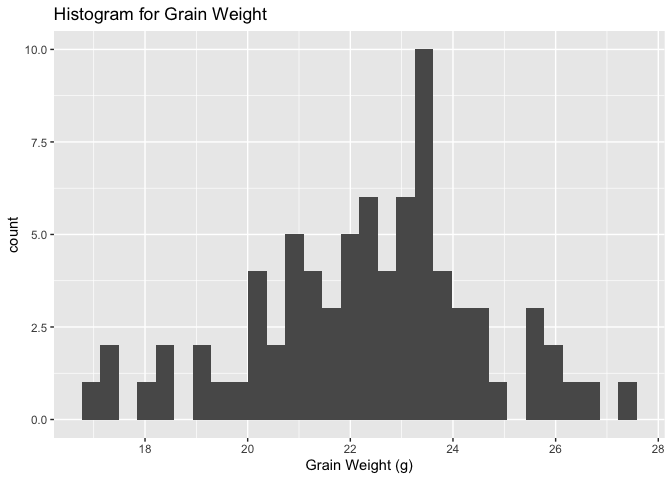<!-- -->

``` r
#barplot of grain weight according to Cultivars
raw%>%ggplot(aes(x = Cultivars, y = meangw))+
 geom_bar(stat = "identity", fun.y = "mean", na.rm = TRUE,
 position = position_dodge(width = 0.9))+
  labs(title = "Barplot of Grain Weight according to Cultivars",
       x = "Cultivars", y = "Grain Weight (g)")
```

    ## Warning: Ignoring unknown parameters: fun.y

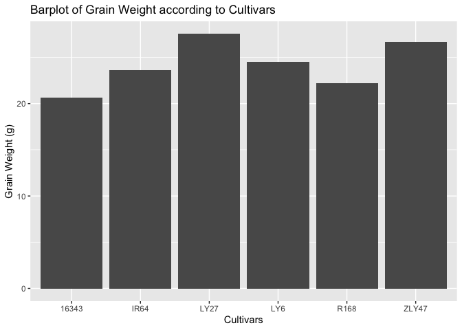<!-- -->

``` r
#barplot of grain weight according to temperature
raw%>%ggplot(aes(x = Tem, y = meangw))+
 geom_bar(stat = "identity", fun.y = "mean", na.rm = TRUE,
 position = position_dodge(width = 0.9)) + 
  labs(title = "Barplot of Grain Weight according to Temperature/°C",
       x = "Temperature/°C", y = "Grain Weight (g)")
```

    ## Warning: Ignoring unknown parameters: fun.y

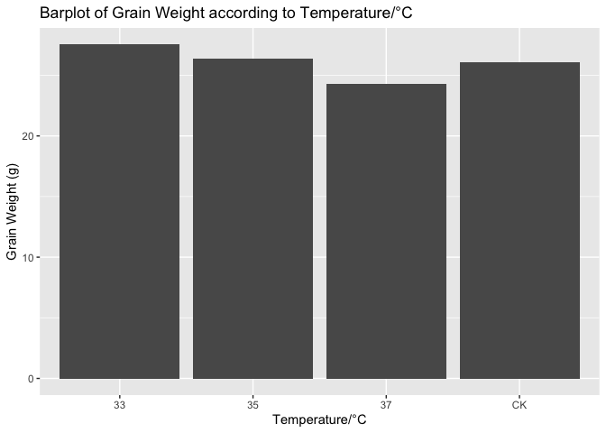<!-- --> These
Univariate graphs show that the distribution of grain weight is bimodal
from the histogram. The bivariate graphs show that Cultivar 16343 has
the smalled grain weight while ZLY47 has the highest. It can also be
seen that grain weight is at it’s smallest at 37°C and is at its highest
at 33°C.

``` r
#transform temp into numeric
raw1<- transform(raw, Tem = as.numeric(Tem))
```

    ## Warning in eval(substitute(list(...)), `_data`, parent.frame()): NAs introduced
    ## by coercion

``` r
raw1<-raw1 %>% select_if(is.numeric) %>%na.omit
#select numerical and remove NA
raw2<-signif(cor(raw1),2)
#returnns integer values
library(corrplot)
```

    ## corrplot 0.84 loaded

``` r
#corrplot is used to create a correlation plot
corrplot(raw2, type = "upper", order = "hclust",
 tl.col = "black", tl.srt = 45, title="Correlation Matrix", mar=c(0,0,2,0))
```

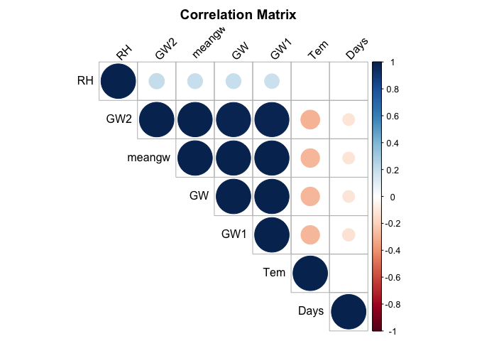<!-- -->

From the correlation matrix it can be seen that relative humidity has a
positive correlation to grain weight while duration of days has the
least. Temperature has a smaller correlation than relative humidity and
is less positive than days.

## Manova

``` r
#conduct a MANOVA test
manova <- manova(cbind(GW,GW1,GW2)  ~ Cultivars, data = raw)
summary(manova)
```

    ##           Df  Pillai approx F num Df den Df   Pr(>F)    
    ## Cultivars  5 0.85059   5.6985     15    216 8.19e-10 ***
    ## Residuals 72                                            
    ## ---
    ## Signif. codes:  0 '***' 0.001 '**' 0.01 '*' 0.05 '.' 0.1 ' ' 1

``` r
#anova
summary.aov(manova)
```

    ##  Response GW :
    ##             Df Sum Sq Mean Sq F value    Pr(>F)    
    ## Cultivars    5 317.24  63.447   51.76 < 2.2e-16 ***
    ## Residuals   72  88.26   1.226                      
    ## ---
    ## Signif. codes:  0 '***' 0.001 '**' 0.01 '*' 0.05 '.' 0.1 ' ' 1
    ## 
    ##  Response GW1 :
    ##             Df  Sum Sq Mean Sq F value    Pr(>F)    
    ## Cultivars    5 291.535  58.307  53.164 < 2.2e-16 ***
    ## Residuals   72  78.965   1.097                      
    ## ---
    ## Signif. codes:  0 '***' 0.001 '**' 0.01 '*' 0.05 '.' 0.1 ' ' 1
    ## 
    ##  Response GW2 :
    ##             Df Sum Sq Mean Sq F value    Pr(>F)    
    ## Cultivars    5 286.68  57.336  38.805 < 2.2e-16 ***
    ## Residuals   72 106.39   1.478                      
    ## ---
    ## Signif. codes:  0 '***' 0.001 '**' 0.01 '*' 0.05 '.' 0.1 ' ' 1

``` r
#post-hoc
pairwise.t.test(raw$GW, raw$Cultivars, p.adj = "none")
```

    ## 
    ##  Pairwise comparisons using t tests with pooled SD 
    ## 
    ## data:  raw$GW and raw$Cultivars 
    ## 
    ##       16343   IR64    LY27    LY6     R168   
    ## IR64  1.3e-12 -       -       -       -      
    ## LY27  < 2e-16 0.00024 -       -       -      
    ## LY6   1.2e-15 0.10531 0.02956 -       -      
    ## R168  4.4e-06 0.00057 1.5e-10 1.5e-06 -      
    ## ZLY47 < 2e-16 3.0e-06 0.23053 0.00100 8.4e-13
    ## 
    ## P value adjustment method: none

``` r
pairwise.t.test(raw$GW1, raw$Cultivars, p.adj = "none")
```

    ## 
    ##  Pairwise comparisons using t tests with pooled SD 
    ## 
    ## data:  raw$GW1 and raw$Cultivars 
    ## 
    ##       16343   IR64    LY27    LY6     R168   
    ## IR64  8.2e-13 -       -       -       -      
    ## LY27  < 2e-16 7.7e-05 -       -       -      
    ## LY6   4.2e-16 0.0788  0.0185  -       -      
    ## R168  1.4e-06 0.0011  8.4e-11 1.8e-06 -      
    ## ZLY47 < 2e-16 3.4e-06 0.4029  0.0018  2.3e-12
    ## 
    ## P value adjustment method: none

``` r
pairwise.t.test(raw$GW2, raw$Cultivars, p.adj = "none")
```

    ## 
    ##  Pairwise comparisons using t tests with pooled SD 
    ## 
    ## data:  raw$GW2 and raw$Cultivars 
    ## 
    ##       16343   IR64    LY27    LY6     R168   
    ## IR64  4.3e-10 -       -       -       -      
    ## LY27  < 2e-16 0.0003  -       -       -      
    ## LY6   1.2e-13 0.0601  0.0631  -       -      
    ## R168  2.3e-05 0.0089  9.7e-09 1.8e-05 -      
    ## ZLY47 < 2e-16 3.4e-05 0.5333  0.0142  6.9e-10
    ## 
    ## P value adjustment method: none

According to the MANOVA at least one of the 3 replicated grain weights
significantly differed by Cultivars. therefore We rejected the null
hypothesis that the grain weights are the same at all sites (pilai =
0.85059, F =5.6985, p &lt;0.05). The ANOVA showed that all of the grain
weights had a p value of 2.2e-16 which is less than 0.05 therefore the
null hypothesis was rejected and all 3 response variables significantly
differed by Cultivars. There was 1 manova, 3 anovas and 18 t-tests
therefore 22 tests were conducted

``` r
#overall type-I error rate
1 - 0.95^22
```

    ## [1] 0.6764665

``` r
#Bonferroni adjusted
0.05/22
```

    ## [1] 0.002272727

``` r
#post hoc tests adjusted
pairwise.t.test(raw$GW, raw$Cultivars, p.adj = "bonferroni")
```

    ## 
    ##  Pairwise comparisons using t tests with pooled SD 
    ## 
    ## data:  raw$GW and raw$Cultivars 
    ## 
    ##       16343   IR64    LY27    LY6     R168   
    ## IR64  1.9e-11 -       -       -       -      
    ## LY27  < 2e-16 0.0037  -       -       -      
    ## LY6   1.8e-14 1.0000  0.4434  -       -      
    ## R168  6.6e-05 0.0085  2.3e-09 2.2e-05 -      
    ## ZLY47 < 2e-16 4.5e-05 1.0000  0.0151  1.3e-11
    ## 
    ## P value adjustment method: bonferroni

``` r
pairwise.t.test(raw$GW1, raw$Cultivars, p.adj = "bonferroni")
```

    ## 
    ##  Pairwise comparisons using t tests with pooled SD 
    ## 
    ## data:  raw$GW1 and raw$Cultivars 
    ## 
    ##       16343   IR64    LY27    LY6     R168   
    ## IR64  1.2e-11 -       -       -       -      
    ## LY27  < 2e-16 0.0012  -       -       -      
    ## LY6   6.3e-15 1.0000  0.2780  -       -      
    ## R168  2.0e-05 0.0159  1.3e-09 2.7e-05 -      
    ## ZLY47 < 2e-16 5.1e-05 1.0000  0.0263  3.4e-11
    ## 
    ## P value adjustment method: bonferroni

``` r
pairwise.t.test(raw$GW2, raw$Cultivars, p.adj = "bonferroni")
```

    ## 
    ##  Pairwise comparisons using t tests with pooled SD 
    ## 
    ## data:  raw$GW2 and raw$Cultivars 
    ## 
    ##       16343   IR64    LY27    LY6     R168   
    ## IR64  6.5e-09 -       -       -       -      
    ## LY27  6.2e-16 0.00453 -       -       -      
    ## LY6   1.8e-12 0.90125 0.94651 -       -      
    ## R168  0.00034 0.13388 1.4e-07 0.00027 -      
    ## ZLY47 < 2e-16 0.00051 1.00000 0.21279 1.0e-08
    ## 
    ## P value adjustment method: bonferroni

The overall type-I error rate is 0.6764665 and 0.002272727 is the the
Bonferroni adjusted significance level that I would use if I want to
keep the overall type I error rate at .05 All the pairwise tests that
were significant before remained significant except for the post hoc
test for GW and GW1 between LY27 and LY6 and for GW 2 between ZLY47 and
LY6, R168 and IR64.

``` r
#Check sample size assumption
raw%>%
  group_by(Cultivars) %>%
  summarise(N = n())
```

    ## # A tibble: 6 x 2
    ##   Cultivars     N
    ##   <chr>     <int>
    ## 1 16343        13
    ## 2 IR64         13
    ## 3 LY27         13
    ## 4 LY6          13
    ## 5 R168         13
    ## 6 ZLY47        13

As the table above shows 13 observations per group, the assumption of
adequate sample size is failed.

``` r
#Identify univariate outliers
library(rstatix)
```

    ## 
    ## Attaching package: 'rstatix'

    ## The following object is masked from 'package:stats':
    ## 
    ##     filter

``` r
raw%>%
  group_by(Cultivars) %>%
  identify_outliers(GW1)
```

    ## # A tibble: 2 x 10
    ##   Cultivars Tem      RH  Days    GW   GW1   GW2 meangw is.outlier is.extreme
    ##   <chr>     <chr> <dbl> <dbl> <dbl> <dbl> <dbl>  <dbl> <lgl>      <lgl>     
    ## 1 R168      37       75    15  19.8  19.6  19.6   19.7 TRUE       FALSE     
    ## 2 R168      CK       NA    NA  22    22.2  22.4   22.2 TRUE       FALSE

There were no univariate extreme outliers,

``` r
#Check univariate normality assumption
raw%>%
  group_by(Cultivars) %>%
  shapiro_test(GW, GW1, GW2) %>%
  arrange(variable)
```

    ## # A tibble: 18 x 4
    ##    Cultivars variable statistic      p
    ##    <chr>     <chr>        <dbl>  <dbl>
    ##  1 16343     GW           0.930 0.345 
    ##  2 IR64      GW           0.911 0.191 
    ##  3 LY27      GW           0.878 0.0668
    ##  4 LY6       GW           0.889 0.0946
    ##  5 R168      GW           0.980 0.981 
    ##  6 ZLY47     GW           0.970 0.897 
    ##  7 16343     GW1          0.919 0.243 
    ##  8 IR64      GW1          0.922 0.265 
    ##  9 LY27      GW1          0.892 0.105 
    ## 10 LY6       GW1          0.886 0.0861
    ## 11 R168      GW1          0.961 0.769 
    ## 12 ZLY47     GW1          0.974 0.940 
    ## 13 16343     GW2          0.958 0.724 
    ## 14 IR64      GW2          0.960 0.760 
    ## 15 LY27      GW2          0.855 0.0331
    ## 16 LY6       GW2          0.928 0.317 
    ## 17 R168      GW2          0.967 0.863 
    ## 18 ZLY47     GW2          0.957 0.701

GW, GW1, GW2 were not normally distributed for each Cultivars groups, as
assessed by Shapiro-Wilk’s test (p &lt; 0.05).

``` r
#Multivariate normality
raw %>%
  select(GW, GW1, GW2) %>%
  mshapiro_test()
```

    ## # A tibble: 1 x 2
    ##   statistic   p.value
    ##       <dbl>     <dbl>
    ## 1     0.912 0.0000513

The test is significant (p &lt; 0.05), so we can not assume multivariate
normality.

``` r
# Create a scatterplot matrix by group
install.packages('GGally')
```

    ## 
    ## The downloaded binary packages are in
    ##  /var/folders/4f/t6dbjc0525l98dbtj98m9ly40000gn/T//RtmpsK9YEi/downloaded_packages

``` r
library(GGally)
```

    ## Registered S3 method overwritten by 'GGally':
    ##   method from   
    ##   +.gg   ggplot2

``` r
results <- raw %>%
  group_by(Cultivars) %>%
  select(GW, GW1, GW2) %>%
  doo(~ggpairs(.) + theme_bw(), result = "plots")
```

    ## Adding missing grouping variables: `Cultivars`

``` r
results$plots
```

    ## [[1]]

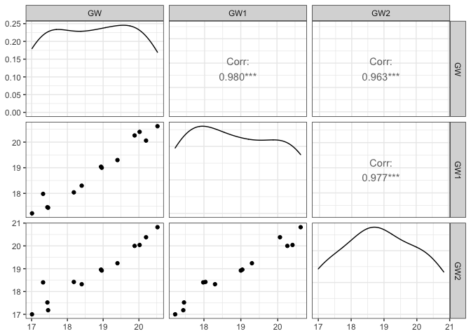<!-- -->

    ## 
    ## [[2]]

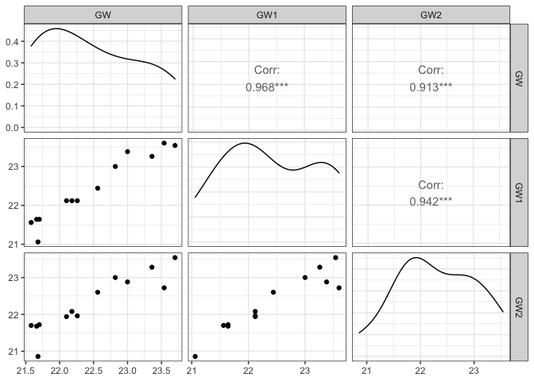<!-- -->

    ## 
    ## [[3]]

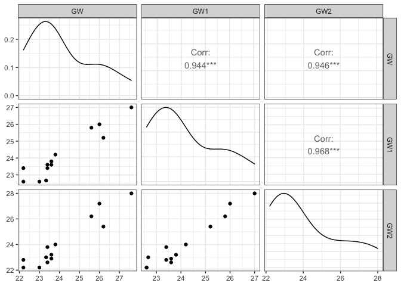<!-- -->

    ## 
    ## [[4]]

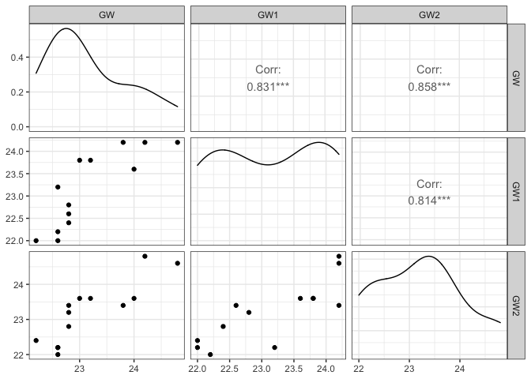<!-- -->

    ## 
    ## [[5]]

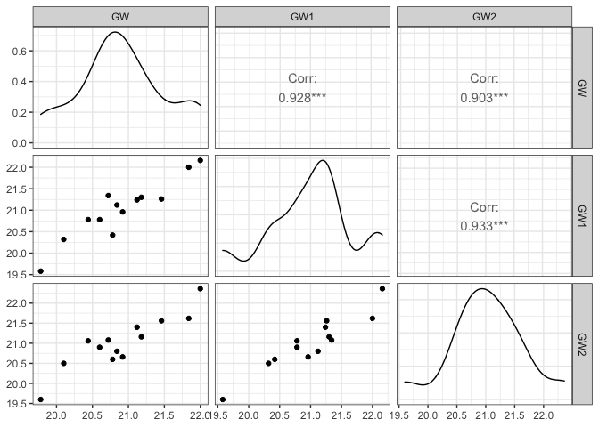<!-- -->

    ## 
    ## [[6]]

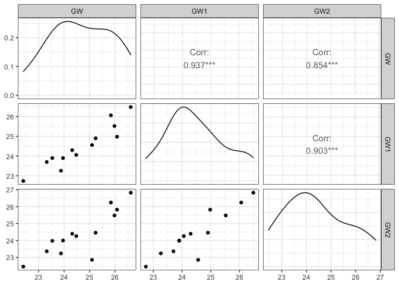<!-- -->

There was a linear relationship between GW, GW1, and GW2 in each
Cultivars group, as assessed by scatterplot.

``` r
#Check the homogneity of variance assumption
raw %>% 
  gather(key = "variable", value = "value", GW, GW1, GW2) %>%
  group_by(variable) %>%
  levene_test(value ~ Cultivars)
```

    ## Warning in leveneTest.default(y = y, group = group, ...): group coerced to
    ## factor.

    ## Warning in leveneTest.default(y = y, group = group, ...): group coerced to
    ## factor.

    ## Warning in leveneTest.default(y = y, group = group, ...): group coerced to
    ## factor.

    ## # A tibble: 3 x 5
    ##   variable   df1   df2 statistic      p
    ##   <chr>    <int> <int>     <dbl>  <dbl>
    ## 1 GW           5    72      2.11 0.0737
    ## 2 GW1          5    72      1.33 0.260 
    ## 3 GW2          5    72      2.29 0.0544

The Levene’s test is not significant (p &gt; 0.05), so there was a
homogeneity of variances.

## Randomization test

``` r
# Observed F-statistic, running anova
summary(aov(meangw ~ Cultivars, data = raw))
```

    ##             Df Sum Sq Mean Sq F value Pr(>F)    
    ## Cultivars    5 298.20   59.64   49.73 <2e-16 ***
    ## Residuals   72  86.34    1.20                   
    ## ---
    ## Signif. codes:  0 '***' 0.001 '**' 0.01 '*' 0.05 '.' 0.1 ' ' 1

``` r
obs_F <- 49.73
```

``` r
Fs <- replicate(5000,{
  # Randomly permute the response variable across doses
  new <- raw %>%
    mutate(meangw = sample(meangw))
  # Compute variation within groups
  SSW <- new %>%
    group_by(Cultivars) %>%
    summarize(SSW = sum((meangw - mean(meangw))^2)) %>%
    summarize(sum(SSW)) %>% 
    pull
  # Compute variation between groups
  SSB <- new %>% 
    mutate(mean = mean(meangw)) %>%
    group_by(Cultivars) %>% 
    mutate(groupmean = mean(meangw)) %>%
    summarize(SSB = sum((mean - groupmean)^2)) %>%
    summarize(sum(SSB)) %>%
    pull
    # Compute the F-statistic (ratio of MSB and MSW)
  # df for SSB is 6 groups - 1 = 5
  # df for SSW is 78 observations - 6 groups = 72
  (SSB/5)/(SSW/72)
})
```

``` r
hist(Fs, prob=T, main = "Distribution of sampled F values"); abline(v = obs_F, col="red", add=T)
```

    ## Warning in int_abline(a = a, b = b, h = h, v = v, untf = untf, ...): "add" is
    ## not a graphical parameter

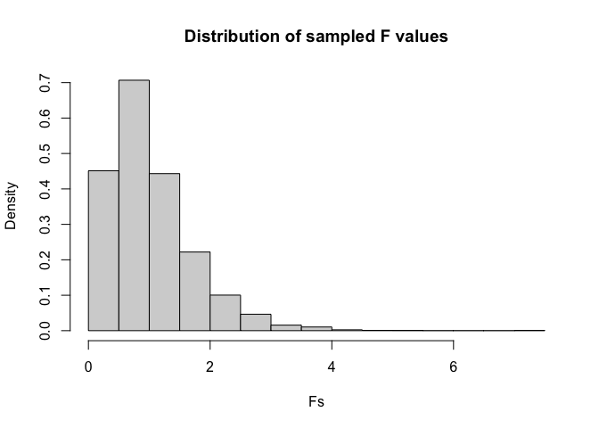<!-- -->

``` r
# Calculate the proportion of F statistic that are greater than the observed F-statistic
mean(Fs > obs_F)
```

    ## [1] 0

The null hypothesis is that there is no significant effect of type of
Cultivars on grain weight. The alternate hypothesis is that there is a
significant effect of type of Cultivars on grain weight. Since the
proportion of F statistic that are greater than the observed F-statistic
is 0 the null hypothesis is rejected therefore there is a significant
effect of type of Cultivars on grain weight. The observed test statistic
is not visibly in the distribution because the F-statistic is much
larger than the majority, supporting the alternative hypothesis.

## Linear regression model.

``` r
#transfrom temp into numeric
raw3<-transform(raw, Tem = as.numeric(Tem))
```

    ## Warning in eval(substitute(list(...)), `_data`, parent.frame()): NAs introduced
    ## by coercion

``` r
#center the `meangw` variable
meangw1 <- raw3$meangw - mean(raw3$meangw, na.rm = TRUE)
#center the `Tem` variable
tem1 <- raw3$Tem - mean(raw3$Tem, na.rm = TRUE)
# Fit a regression model
fit <- lm(meangw1 ~ Cultivars*tem1, data=raw3)
summary(fit)
```

    ## 
    ## Call:
    ## lm(formula = meangw1 ~ Cultivars * tem1, data = raw3)
    ## 
    ## Residuals:
    ##      Min       1Q   Median       3Q      Max 
    ## -1.77083 -0.45833  0.04778  0.34948  2.40833 
    ## 
    ## Coefficients:
    ##                      Estimate Std. Error t value Pr(>|t|)    
    ## (Intercept)         -3.630919   0.227908 -15.932  < 2e-16 ***
    ## CultivarsIR64        3.614722   0.322310  11.215 2.33e-16 ***
    ## CultivarsLY27        5.280833   0.322310  16.384  < 2e-16 ***
    ## CultivarsLY6         4.361389   0.322310  13.532  < 2e-16 ***
    ## CultivarsR168        2.173056   0.322310   6.742 6.88e-09 ***
    ## CultivarsZLY47       5.688056   0.322310  17.648  < 2e-16 ***
    ## tem1                -0.577292   0.139564  -4.136 0.000112 ***
    ## CultivarsIR64:tem1   0.212292   0.197374   1.076 0.286420    
    ## CultivarsLY27:tem1   0.004375   0.197374   0.022 0.982389    
    ## CultivarsLY6:tem1    0.418958   0.197374   2.123 0.037918 *  
    ## CultivarsR168:tem1   0.466875   0.197374   2.365 0.021258 *  
    ## CultivarsZLY47:tem1  0.010208   0.197374   0.052 0.958923    
    ## ---
    ## Signif. codes:  0 '***' 0.001 '**' 0.01 '*' 0.05 '.' 0.1 ' ' 1
    ## 
    ## Residual standard error: 0.7895 on 60 degrees of freedom
    ##   (6 observations deleted due to missingness)
    ## Multiple R-squared:  0.8922, Adjusted R-squared:  0.8725 
    ## F-statistic: 45.15 on 11 and 60 DF,  p-value: < 2.2e-16

The variable ‘meangw’ and ‘tem’ was mean-centered, meaning grain weight
and temperature is held constant at its mean instead of 0. The intercept
is when Temperature = mean and Cultivars= 16343 as that is the reference
variable, meaning that grain weight would be -3.630919 g in those
conditions. This is a significant effect. When Cultivars type shifts
from 16343 to IR64, grain weight would change by 3.614722 g. This is a
significant effect. When Cultivars type shifts from 16343 to LY27, grain
weight would change by 5.280833g. This is a significant effect. When
Cultivars type shifts from 16343 to LY6, grain weight would change by
4.361389g. This is a significant effect. When Cultivars type shifts from
16343 to R168, grain weight would change by 2.173056g. This is a
significant effect When Cultivars type shifts from 16343 to LY47, grain
weight would change by 5.688056g. This is a significant effect. When
temperature increases, grain weight could change by -0.577292 g. This is
a significant effect. When Cultivars type shifts from 16343 to IR64 and
temperature increases, grain weight could change by 0.212292 g. When
Cultivars type shifts from 16343 to LY27 and temperature increases,
grain weight could change by 0.004375 g. When Cultivars type shifts from
16343 to LY6 and temperature increases, grain weight could change by
0.418958 g. When Cultivars type shifts from 16343 to R168 and
temperature increases, grain weight could change by 0.466875 g. This is
a significant effect. When Cultivars type shifts from 16343 to ZLY47 and
temperature increases, grain weight could change by 0.010208 g. This is
a significant effect.

``` r
#Create a graph to visualize the interaction between 2 variables on the response
raw3%>% drop_na(Cultivars)%>%ggplot(aes(x=tem1, y=meangw1, col = Cultivars))+geom_smooth(method = "lm")+ ggtitle("Grain weight accoding to Temp and Cultivars") +
 xlab("Temp (°C)") + ylab("Grain weight (g)")
```

    ## `geom_smooth()` using formula 'y ~ x'

    ## Warning: Removed 6 rows containing non-finite values (stat_smooth).

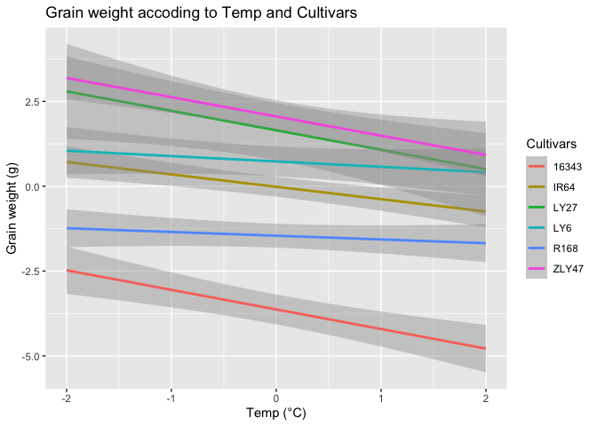<!-- -->

``` r
#proportion of the variation
 summary(fit)$r.squared 
```

    ## [1] 0.8922191

According to this linear regression model as temperature increases,
grain weight decreases. the interaction between the centered grain
weight and Cultivars 16363 seem to be the most important. My model
explains 89.22% of the variation in the response.

``` r
#Check assumptions of linearity
plot(fit, 1)
```

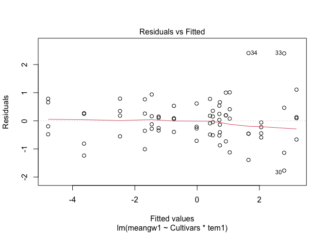<!-- --> the red
line should be approximately horizontal at zero and the residual plot
shows no fitted pattern. This suggests that we can assume linear
relationship between the predictors and the outcome variables.

``` r
#Check assumptions of normality
plot(fit, 2)
```

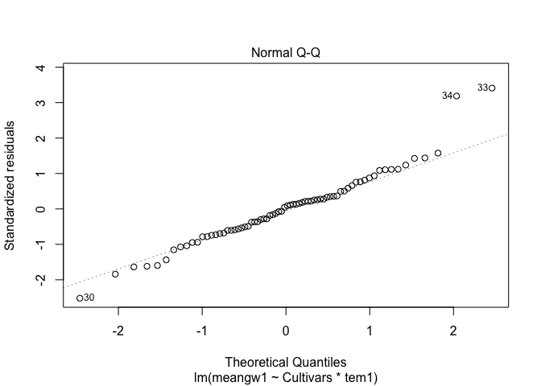<!-- --> All the
points fall approximately along this reference line, so we can assume
normality.

``` r
#Check assumptions of homoscedasticity
plot(fit, 3)
```

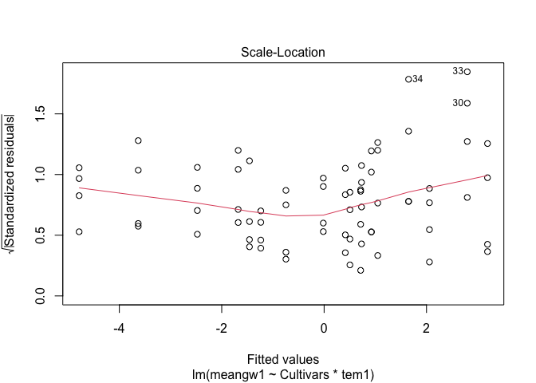<!-- --> The
Scale-Location was used to check the homogeneity of variance of the
residuals however the residuals are not spread equally along the ranges
of predictors there isn’t a horizontal line so the Homogeneity of
residuals variance assumption was not met

``` r
#recompute regression results with robust standard errors. 
install.packages("lmtest")
```

    ## 
    ## The downloaded binary packages are in
    ##  /var/folders/4f/t6dbjc0525l98dbtj98m9ly40000gn/T//RtmpsK9YEi/downloaded_packages

``` r
library(lmtest)
```

    ## Loading required package: zoo

    ## 
    ## Attaching package: 'zoo'

    ## The following objects are masked from 'package:base':
    ## 
    ##     as.Date, as.Date.numeric

``` r
library(sandwich)
coeftest(fit,vcov.=vcovHC(fit,type="HC1"))
```

    ## 
    ## t test of coefficients:
    ## 
    ##                      Estimate Std. Error  t value  Pr(>|t|)    
    ## (Intercept)         -3.630919   0.198272 -18.3128 < 2.2e-16 ***
    ## CultivarsIR64        3.614722   0.237960  15.1904 < 2.2e-16 ***
    ## CultivarsLY27        5.280833   0.444147  11.8898 < 2.2e-16 ***
    ## CultivarsLY6         4.361389   0.280465  15.5506 < 2.2e-16 ***
    ## CultivarsR168        2.173056   0.253823   8.5613 5.438e-12 ***
    ## CultivarsZLY47       5.688056   0.268179  21.2099 < 2.2e-16 ***
    ## tem1                -0.577292   0.105934  -5.4495 9.978e-07 ***
    ## CultivarsIR64:tem1   0.212292   0.127494   1.6651  0.101105    
    ## CultivarsLY27:tem1   0.004375   0.248668   0.0176  0.986021    
    ## CultivarsLY6:tem1    0.418958   0.163950   2.5554  0.013159 *  
    ## CultivarsR168:tem1   0.466875   0.143761   3.2476  0.001908 ** 
    ## CultivarsZLY47:tem1  0.010208   0.163508   0.0624  0.950425    
    ## ---
    ## Signif. codes:  0 '***' 0.001 '**' 0.01 '*' 0.05 '.' 0.1 ' ' 1

Everything that was significant before was significant after recomputing
regression results with robust standard errors. In addition the effect
of Cultivars R168 as temp increases on grain weight becomes more
significant.

``` r
# Repeat bootstrapping 5000 times, saving the coefficients each time
samp_SEs <- replicate(5000, {
  # Bootstrap your data (resample observations)
  boot_data <- sample_frac(raw3, replace = TRUE)
  # Fit regression model
  fitboot <- lm(meangw1 ~ Cultivars*tem1, data=boot_data)
  # Save the coefficients
  coef(fitboot)
})
```

``` r
# Estimated SEs
samp_SEs %>%
  # Transpose the obtained matrices
  t %>%
  # Consider the matrix as a data frame
  as.data.frame %>%
  # Compute the standard error (standard deviation of the sampling distribution)
  summarize_all(sd)
```

    ##   (Intercept) CultivarsIR64 CultivarsLY27 CultivarsLY6 CultivarsR168
    ## 1   0.6388491     0.9729828     0.9544189    0.9589198     0.9716851
    ##   CultivarsZLY47      tem1 CultivarsIR64:tem1 CultivarsLY27:tem1
    ## 1      0.9649161 0.4013797                 NA                 NA
    ##   CultivarsLY6:tem1 CultivarsR168:tem1 CultivarsZLY47:tem1
    ## 1                NA                 NA                  NA

The bootstrapped standard errors were a lot larger than the the original
SEs and the robust SEs. There doesn’t seem to be any standard errors in
the interactions.

## Logistic Regression.

``` r
#create a dichotomous outcome variable `y` 
new<-subset(raw, Cultivars == "16343"|Cultivars == "ZLY47")
new<- new %>%
  mutate(y = ifelse(Cultivars == "16343", 0,1))
#fit logistic regression
fit1 <- glm(y ~ meangw+Tem, data = new, family = binomial(link="logit"))
```

    ## Warning: glm.fit: fitted probabilities numerically 0 or 1 occurred

``` r
fit2 <- glm(y ~ meangw*Tem, data = new, family = binomial(link="logit"))
```

    ## Warning: glm.fit: fitted probabilities numerically 0 or 1 occurred

``` r
#Akaike information criterion
summary(fit1)$aic
```

    ## [1] 10

``` r
summary(fit2)$aic
```

    ## [1] 16

``` r
summary(fit1)
```

    ## 
    ## Call:
    ## glm(formula = y ~ meangw + Tem, family = binomial(link = "logit"), 
    ##     data = new)
    ## 
    ## Deviance Residuals: 
    ##        Min          1Q      Median          3Q         Max  
    ## -7.311e-06  -2.110e-08   0.000e+00   2.110e-08   8.266e-06  
    ## 
    ## Coefficients:
    ##               Estimate Std. Error z value Pr(>|z|)
    ## (Intercept) -2.630e+02  5.952e+05       0        1
    ## meangw       1.155e+01  2.586e+04       0        1
    ## Tem35        1.622e+01  3.642e+05       0        1
    ## Tem37        2.674e+01  1.264e+05       0        1
    ## TemCK       -3.909e+00  4.745e+07       0        1
    ## 
    ## (Dispersion parameter for binomial family taken to be 1)
    ## 
    ##     Null deviance: 3.6044e+01  on 25  degrees of freedom
    ## Residual deviance: 2.4765e-10  on 21  degrees of freedom
    ## AIC: 10
    ## 
    ## Number of Fisher Scoring iterations: 25

Fit 1 has the lowest AIC and therefore is the best fit to predict ‘y’
The intercept is when Temp is at 33°C and meangw =0, y changes by
-2.630e+02 . As grain weight increases, y changes by 1.155e+01 and when
controlling for the different temp, there is not a significant effect of
grain weight on cultivars. When temp changes from 33°C to 35 °C, y
changes by 1.622e+01 and when controlling for grain weight, there is not
a significant effect of temp on cultivars. When temp changes from 33°C
to 37 °C, y changes by 2.674e+01 and when controlling for grain weight,
there is not a significant effect of temp on cultivars. When temp
changes from 33°C to CK, y changes by -3.909e+00 and when controlling
for grain weight, there is not a significant effect of temp on
cultivars.

``` r
#odds ratio
exp(coef(fit1))
```

    ##   (Intercept)        meangw         Tem35         Tem37         TemCK 
    ## 6.261440e-115  1.040757e+05  1.106985e+07  4.093664e+11  2.006790e-02

Coefficients represent odds ratios. The corresponding odds ratio for
meangw is 1.040757e+05 , Tem35 is 1.106985e+07 times what it is in tem
33, Tem37 is 4.093664e+11 times what it is in tem 33, and TemCK is
2.006790e-02 times what it is in tem 33.

``` r
install.packages("yardstick")
```

    ## 
    ## The downloaded binary packages are in
    ##  /var/folders/4f/t6dbjc0525l98dbtj98m9ly40000gn/T//RtmpsK9YEi/downloaded_packages

``` r
library(yardstick)
```

    ## For binary classification, the first factor level is assumed to be the event.
    ## Use the argument `event_level = "second"` to alter this as needed.

    ## 
    ## Attaching package: 'yardstick'

    ## The following object is masked from 'package:readr':
    ## 
    ##     spec

``` r
library(caret)
```

    ## Loading required package: lattice

    ## 
    ## Attaching package: 'caret'

    ## The following objects are masked from 'package:yardstick':
    ## 
    ##     precision, recall, sensitivity, specificity

    ## The following object is masked from 'package:purrr':
    ## 
    ##     lift

``` r
#confusion matrix
new$prob <- predict(fit1, type = "response")
new$predicted <- ifelse(new$prob > 0.50,
         "ZLY47", "16343")
conf_matrix<-table(truth = new$y, prediction = new$predicted)
conf_matrix
```

    ##      prediction
    ## truth 16343 ZLY47
    ##     0    13     0
    ##     1     0    13

``` r
# Accuracy (correctly classified cases)
(13 + 13)/26
```

    ## [1] 1

``` r
# Sensitivity (True Positive Rate, TPR)
13/13
```

    ## [1] 1

``` r
# Specificity (True Negative Rate, TNR)
13/13
```

    ## [1] 1

``` r
# Precision (Positive Predictive Value, PPV)
13/13
```

    ## [1] 1

The confusion matrix showed a perfect prediction with 1 for of Accuracy,
Sensitivity, Specificity and Precision.

``` r
#density plot
new$logit <- predict(fit1)
ggplot(new, aes(logit, fill = as.factor(Cultivars))) +
  geom_density(alpha = .5) +
  geom_vline(xintercept = 0, lty = 2) + ggtitle("Density plot of Cultivars") 
```

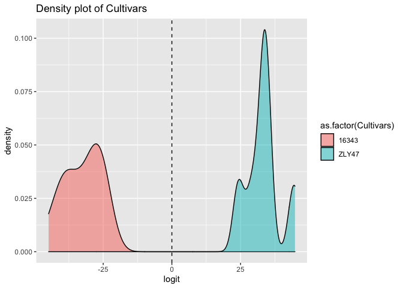<!-- --> ZLY47 has
the highest density while 16343 has the lowest.

``` r
install.packages("plotROC")
```

    ## 
    ## The downloaded binary packages are in
    ##  /var/folders/4f/t6dbjc0525l98dbtj98m9ly40000gn/T//RtmpsK9YEi/downloaded_packages

``` r
library(plotROC)
```

``` r
new$probabilities<-predict(fit1, type ="response")
ROC<-ggplot(new)+geom_roc(aes(d= y, m= probabilities))+ ggtitle("ROC
curve")
ROC
```

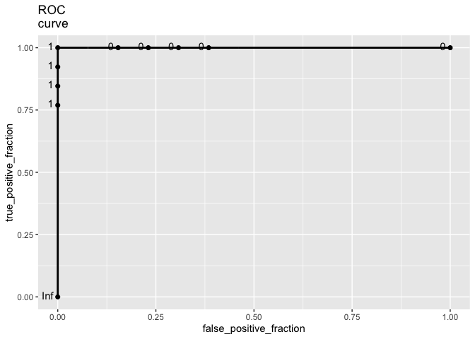<!-- -->

``` r
calc_auc(ROC)$AUC
```

    ## [1] 1

AUC is 1. The AUC indicates the prediction power of the model. According
to the rule of thumb, this model is perfect at predicting Cultivars from
grain weight and Temp.
